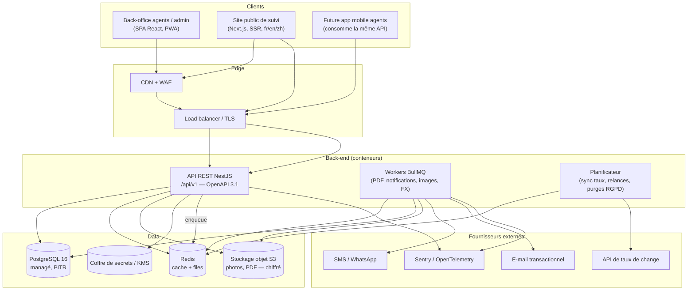
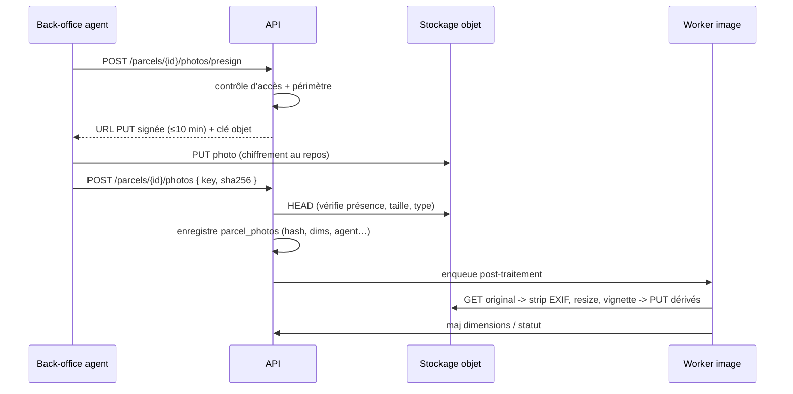
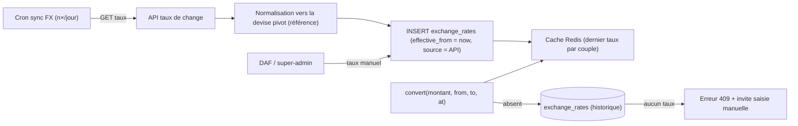
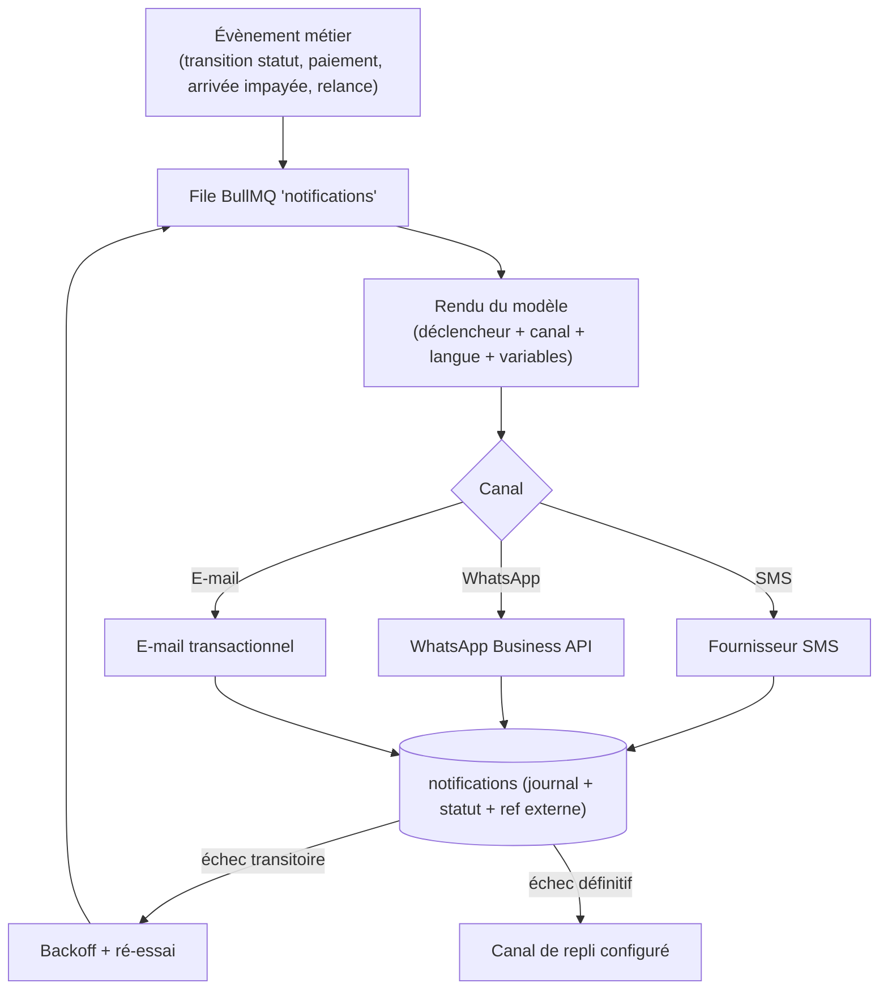
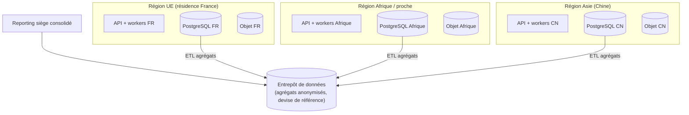
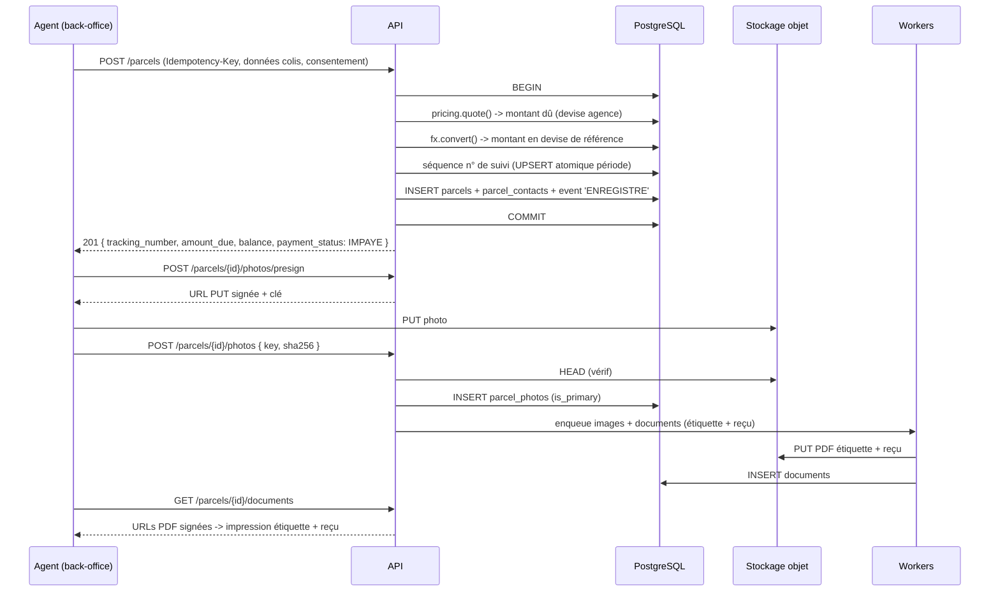
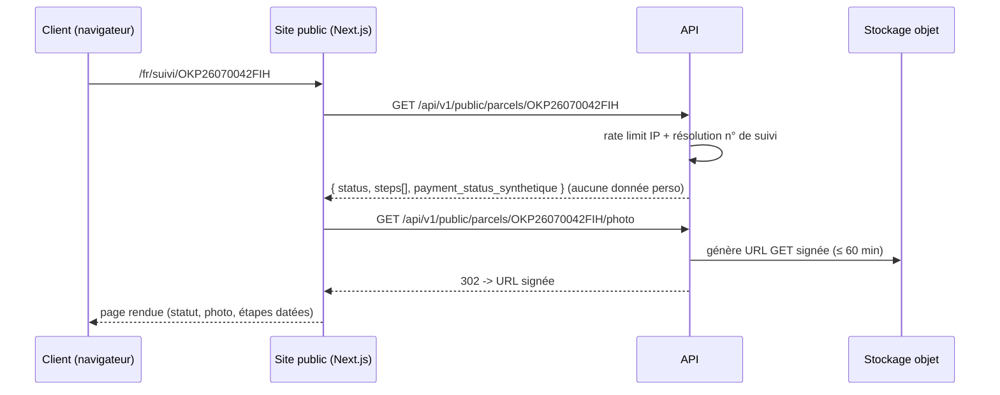
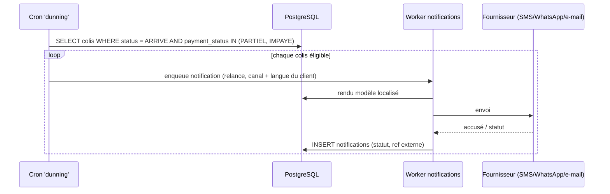

# 02 — Architecture

Version 1.0 — 2026-09-03
Complète [`01-specifications-techniques.md`](01-specifications-techniques.md).

---

## Table des matières

1. [Vue d'ensemble](#1-vue-densemble)
2. [Choix de stack](#2-choix-de-stack)
3. [Composants back-end](#3-composants-back-end)
4. [Front-end](#4-front-end)
5. [Conception de l'API REST](#5-conception-de-lapi-rest)
6. [Stockage des photos](#6-stockage-des-photos)
7. [Multi-devises et taux de change](#7-multi-devises-et-taux-de-change)
8. [Notifications](#8-notifications)
9. [Traitements asynchrones](#9-traitements-asynchrones)
10. [Sécurité](#10-securite)
11. [RGPD et résidence des données](#11-rgpd-et-residence-des-donnees)
12. [Observabilité](#12-observabilite)
13. [Environnements, CI/CD, IaC](#13-environnements-cicd-iac)
14. [Topologie de déploiement multi-pays](#14-topologie-de-deploiement-multi-pays)
15. [Diagrammes de séquence clés](#15-diagrammes-de-sequence-cles)
16. [Stratégie de tests](#16-strategie-de-tests)
17. [Décisions d'architecture (ADR)](#17-decisions-darchitecture-adr)

---

## 1. Vue d'ensemble

Architecture **3-tiers modulaire** : clients web → API REST (monolithe modulaire NestJS) →
PostgreSQL centralisé + stockage objet + Redis. Traitements longs (PDF, notifications, sync
taux, images) délégués à des *workers* via une file Redis/BullMQ.



### Pourquoi un monolithe modulaire (et pas des microservices)

Volume et équipe de départ modestes ; la priorité est la **fiabilité**, la **cohérence
transactionnelle** (colis ↔ paiements ↔ pièces comptables ↔ séquences) et la **vitesse de
livraison**. Les frontières de modules sont nettes (`parcels`, `payments`, `billing`,
`pricing`, `fx`, `notifications`, `config`, `iam`, `reporting`) : un découpage en services
reste possible plus tard sans réécriture du domaine.

---

## 2. Choix de stack

| Besoin | Choix | Justification |
|--------|-------|---------------|
| Langage back-end | **TypeScript / Node.js LTS** | Demandé ; un seul langage front + back ; large vivier de développeurs ; écosystème mûr pour paiements, PDF, i18n. |
| Framework back-end | **NestJS** | Structure modulaire imposée (DI, modules, guards, interceptors), idéal RBAC + audit + validation ; génération OpenAPI native ; testable. |
| ORM / migrations | **Prisma** | Schéma typé, migrations versionnées, DX élevée. `NUMERIC` mappé en `Decimal`. Requêtes brutes possibles pour le reporting. |
| Base de données | **PostgreSQL 16** — **OVHcloud Managed Databases for PostgreSQL** (D12) | Transactions ACID, `NUMERIC` exact, `jsonb`, `citext`, `pg_trgm`, partitionnement, RLS optionnel, PITR, région UE (Gravelines/Strasbourg). |
| Cache + files | **Redis + BullMQ** (Redis managé OVHcloud, ou conteneur dédié) | Files fiables avec ré-essai/backoff pour notifications, PDF, images, sync FX ; cache de config et de taux. |
| Stockage fichiers | **OVHcloud Object Storage** (S3-compatible, région UE) ; **MinIO** en dev | URL signées, chiffrement au repos (SSE), cycle de vie aligné rétention, versioning objet. |
| Hébergeur | **OVHcloud** (D12) — Managed Kubernetes Service *ou* Public Cloud Instances, régions UE | Résidence des données UE native pour le périmètre France ; souveraineté. |
| Notifications | **Meta WhatsApp Business API** (officielle) ; **Amazon SES** (e-mail) ; **SMS** : agrégateur à choisir (O-1) | D7 ; secrets dans le coffre ; abstraction `NotificationProvider`. |
| Taux de change | **exchangerate.host** + saisie manuelle prioritaire (D8) | Job `fx-sync` planifié ; historisation append-only. |
| Front back-office | **React 18 + Vite + TypeScript** | Demandé ; TanStack Query (cache serveur), React Hook Form + Zod, React Router, i18next, PWA (capture photo, futur hors-ligne). |
| Bibliothèque UI | **Radix UI + Tailwind** (ou MUI) | Composants accessibles (WCAG), thème piloté par tokens = couleurs de marque configurables. |
| Site public de suivi | **Next.js** (App Router, SSR/ISR) | SEO, performance sur 3G, i18n fr/en/zh, surface séparée du back-office. |
| PDF (étiquettes, reçus, factures) | **@react-pdf/renderer** ou **Puppeteer+HTML** | Gabarits maintenables ; QR (`qrcode`) + code-barres Code 128 (`bwip-js`). |
| Auth | **JWT** (access + refresh rotatif) + **Argon2id** + **TOTP** (`otplib`) | Sessions courtes, révocables ; MFA pour le siège. |
| Validation | **Zod** partagé front/back (`packages/shared`) | Un seul schéma de contrat. |
| Observabilité | **pino**, **OpenTelemetry**, **Sentry**, **Prometheus/Grafana** | Logs corrélés, traces, erreurs, métriques métier. |
| Conteneurisation | **Docker** ; orchestration Kubernetes *ou* plateforme conteneurs managée | Portabilité multi-hébergeur (contrainte de résidence UE). |
| CI/CD | **GitHub Actions** | Lint, tests, SAST, audit deps, build image, migrations, déploiement par environnement. |
| IaC | **Terraform** | Reproductibilité des environnements et des régions (FR/UE, Afrique, Asie). |
| Monorepo | **pnpm workspaces + Turborepo** | `apps/*` + `packages/*`, cache de build, contrats partagés. |

---

## 3. Composants back-end

Modules NestJS (un dossier par module, découplés par des interfaces) :

| Module | Responsabilité | Points clés |
|--------|----------------|-------------|
| `iam` | Authentification, MFA, utilisateurs, rôles, permissions, périmètres, sessions. | Guards RBAC + périmètre ; émission/rotation des jetons ; politique mot de passe. |
| `config` | Référentiel et configuration autonome : pays, villes, agences, devises, corridors, paramètres, textes multilingues, modèles de notification, identité visuelle. | Cache Redis avec invalidation ; versionnement + prévisualisation ; secrets exclus (KMS). |
| `pricing` | Grilles tarifaires, calcul du montant dû, fourchette de dérogation. | Fonction pure `quote(corridor, mode, poids, options)` ; historisation des grilles. |
| `fx` | Devises, taux de change, historisation, sync API, conversion. | `convert(montant, from, to, at)` ; devise pivot = devise de référence ; blocage si taux absent. |
| `parcels` | Cycle de vie du colis, parties, photos, évènements de suivi, numéro de suivi. | Machine à états ; génération atomique du numéro ; règles d'immuabilité photo. |
| `payments` | Paiements, statuts, remboursements, recalcul solde/statut. | Transactions ; idempotence ; hooks vers `billing` et `notifications`. |
| `billing` | Reçus, factures, avoirs, numérotation séquentielle, PDF. | Séquences par pays/agence ; pièces immuables ; export comptable. |
| `notifications` | Modèles, rendu localisé, envoi multi-canal, journal, ré-essai, relances. | Abstraction `NotificationProvider` ; file BullMQ ; respect consentements. |
| `tracking-public` | Endpoints publics de suivi (lecture filtrée), URL signée photo, anti-abus. | Aucune donnée personnelle directe ; rate limit ; cache court. |
| `reporting` | Agrégats, tableaux de bord, exports Excel/PDF/CSV. | Requêtes SQL dédiées + vues matérialisées ; exports asynchrones. |
| `audit` | Journalisation transverse des actions sensibles. | Interceptor global ; table append-only ; export. |
| `gdpr` | Demandes d'accès / d'effacement, anonymisation, rétention. | Orchestration multi-tables ; traçabilité ; purge planifiée. |
| `files` | Presigned URLs (upload/lecture), post-traitement image (strip EXIF, resize, hash). | Politique d'expiration ; antivirus optionnel ; worker image. |
| `health` | Sondes liveness/readiness, versions, statut des dépendances. | |

Transverses : `PrismaService`, `RequestContext` (utilisateur + périmètre + `request_id`),
`IdempotencyInterceptor`, `ScopeGuard`, `AuditInterceptor`, filtre d'exceptions normalisé.

---

## 4. Front-end

### 4.1 Back-office (`apps/back-office`)

- SPA React + Vite, **PWA** (capture caméra via `getUserMedia`, installable sur tablette
  agence, socle pour le mode hors-ligne v1.1).
- Espaces par rôle, routes protégées, menu et actions filtrés par permissions.
- Écrans principaux : tableau de bord agence, **enregistrement colis** (formulaire +
  capture photo + calcul prix + impression), fiche colis (suivi, paiements, pièces,
  photos), **encaissement**, recherche, administration (rapports, tarifs, taux, export),
  super-admin (utilisateurs, config, identité visuelle, villes/pays/devises, textes).
- État serveur : TanStack Query ; formulaires : React Hook Form + Zod (schémas partagés) ;
  i18n : i18next (**fr, en, zh dès la v1** — D14).
- Thème : tokens CSS alimentés par la configuration (couleurs de marque, logo).
- Impression : aperçu PDF étiquette (100 × 150 mm) + reçu ; bouton « imprimer » ;
  fallback impression navigateur.

### 4.2 Site public de suivi (`apps/suivi-public`)

- Next.js, rendu serveur + revalidation courte, **fr / en / zh**, WCAG 2.1 AA.
- Une page de saisie + une page résultat (`/{lang}/suivi/{numero}`), très légère.
- Consomme un sous-ensemble **public** de l'API (`/api/v1/public/...`), sans jeton.
- Affiche statut, photo (URL signée), statut de paiement synthétique, étapes datées.
- Bannière cookies minimale, mentions légales par pays/langue (contenu configurable).

### 4.3 Contrats partagés (`packages/shared`)

Types TypeScript, schémas Zod, énumérations, clés i18n, utilitaires de formatage
monétaire/date — importés par l'API et les deux fronts.

---

## 5. Conception de l'API REST

### 5.1 Principes

| Aspect | Règle |
|--------|-------|
| Base | `/api/v1`. Changement cassant ⇒ `/api/v2`, `v1` maintenue pendant une période de dépréciation. |
| Format | JSON UTF-8. Dates ISO 8601 UTC. Montants : `{ "amount": "1234.56", "currency": "USD" }` (chaîne décimale, jamais de flottant). |
| Auth | `Authorization: Bearer <access_jwt>`. Refresh via `POST /auth/token` (rotation, cookie httpOnly pour le web). |
| Autorisation | RBAC (permissions nommées) + périmètre agence/pays appliqué côté serveur à chaque requête. |
| Surfaces séparées | `/api/v1/public/*` (sans auth, lecture suivi) ; `/api/v1/*` (agents/admin) ; `/api/v1/admin/*` (DAF/super-admin). Séparation logique + politique WAF distincte. |
| Pagination | `?page=` / `?limit=` (défaut 20, max 100) + curseur `?cursor=` pour les grands volumes ; enveloppe `{ data, page: { total, ... } }`. |
| Filtres / tri | `?status=`, `?country=`, `?from=`/`?to=`, `?sort=-created_at`. |
| Idempotence | En-tête `Idempotency-Key` sur `POST /parcels` et `POST /parcels/{id}/payments`. |
| Erreurs | Enveloppe normalisée `{ error: { code, message, details[], request_id } }`. Codes HTTP standards. Messages localisables via `Accept-Language`. |
| Débit | Rate limiting par IP + par utilisateur ; plus strict sur `/public/*` et `/auth/*`. |
| Docs | OpenAPI 3.1 généré, publié sur `/api/v1/docs` (protégé hors prod). |
| Corrélation | En-tête `X-Request-Id` propagé et journalisé. |

### 5.2 Ressources principales (extrait)

```
# Authentification & compte
POST   /api/v1/auth/login                 # e-mail + mot de passe (+ OTP si requis)
POST   /api/v1/auth/token                 # rotation du refresh token
POST   /api/v1/auth/logout
POST   /api/v1/auth/mfa/enroll | /verify
GET    /api/v1/me

# Colis
POST   /api/v1/parcels                    # crée (Idempotency-Key) -> n° de suivi, montant dû
GET    /api/v1/parcels                    # liste filtrée (périmètre appliqué)
GET    /api/v1/parcels/{id}
PATCH  /api/v1/parcels/{id}               # champs éditables avant EN_TRANSIT
POST   /api/v1/parcels/{id}/transition    # { to: "EN_TRANSIT", location, note }
POST   /api/v1/parcels/{id}/cancel        # { reason }
GET    /api/v1/parcels/{id}/events

# Photos
POST   /api/v1/parcels/{id}/photos/presign   # -> URL PUT signée + clé
POST   /api/v1/parcels/{id}/photos           # confirme l'upload { key, sha256 }
GET    /api/v1/parcels/{id}/photos           # -> URLs GET signées

# Paiements & facturation
POST   /api/v1/parcels/{id}/payments         # { amount, currency, method, provider?, external_ref? }
GET    /api/v1/parcels/{id}/payments
POST   /api/v1/payments/{id}/confirm         # Mobile Money / carte
POST   /api/v1/payments/{id}/refund          # DAF / super-admin, { amount?, reason }
GET    /api/v1/parcels/{id}/documents        # reçus, factures, avoirs (PDF signés)

# Devises & tarifs (admin)
GET    /api/v1/currencies
POST   /api/v1/admin/currencies
GET    /api/v1/exchange-rates?from=USD&to=CDF&at=2026-07-01
POST   /api/v1/admin/exchange-rates          # taux manuel (historisé)
GET    /api/v1/admin/tariffs
POST   /api/v1/admin/tariffs
POST   /api/v1/pricing/quote                 # { origin, destination, mode, weight } -> prix

# Configuration autonome (super-admin)
GET/PUT /api/v1/admin/settings               # identité visuelle, contacts, réseaux sociaux
GET/POST /api/v1/admin/countries | /cities | /agencies | /corridors
GET/PUT  /api/v1/admin/content/{key}?lang=fr # textes du site public
GET/POST /api/v1/admin/notification-templates

# Rapports (DAF / super-admin)
GET    /api/v1/admin/reports/overview
GET    /api/v1/admin/reports/revenue?group_by=currency&from=&to=
GET    /api/v1/admin/reports/unpaid
POST   /api/v1/admin/exports                 # async -> { export_id }
GET    /api/v1/admin/exports/{id}            # statut + URL de téléchargement signée

# Utilisateurs & audit (super-admin / DAF)
GET/POST /api/v1/admin/users
POST   /api/v1/admin/users/{id}/roles
GET    /api/v1/admin/audit-logs

# RGPD
POST   /api/v1/admin/gdpr/access-requests
POST   /api/v1/admin/gdpr/erasure-requests

# Public (sans authentification)
GET    /api/v1/public/parcels/{tracking_number}      # statut, étapes, statut paiement synthétique
GET    /api/v1/public/parcels/{tracking_number}/photo # 302 -> URL signée temporaire
GET    /api/v1/public/content/{key}?lang=zh
```

### 5.3 Exemple — création d'un colis

```http
POST /api/v1/parcels
Authorization: Bearer <jwt>
Idempotency-Key: 5f0c…-agence-cotonou-poste-2
Content-Type: application/json

{
  "sender":    { "name": "Awa D.", "phone": "+22990000000", "email": null, "address": "Cotonou" },
  "recipient": { "name": "Jean K.", "phone": "+243810000000", "address": "Kinshasa, Gombe" },
  "origin_city_id": "…COO…",
  "destination_city_id": "…FIH…",
  "transport_mode": "AIR",
  "weight_kg": "12.40",
  "content_nature": "Pièces détachées",
  "declared_value": { "amount": "300.00", "currency": "USD" },
  "billing_currency": "USD",
  "client_channel": "WHATSAPP",
  "client_language": "fr",
  "consent": { "given": true, "text_version": "v1-2026-01" }
}
```

Réponse `201` (extrait) :

```json
{
  "data": {
    "id": "…",
    "tracking_number": "OKP26070042FIH",
    "status": "ENREGISTRE",
    "billing_currency": "USD",
    "amount_due": { "amount": "148.00", "currency": "USD" },
    "amount_paid": { "amount": "0.00", "currency": "USD" },
    "balance":    { "amount": "148.00", "currency": "USD" },
    "payment_status": "IMPAYE",
    "reference_amount_due": { "amount": "148.00", "currency": "USD" },
    "label_pdf_url": "https://…signed…",
    "receipt_pdf_url": "https://…signed…"
  }
}
```

---

## 6. Stockage des photos



- **Aucun accès public direct** au bucket. Lecture uniquement par URL GET signée générée
  après contrôle : ≤ 15 min en interne, ≤ 60 min pour l'affichage client (endpoint public
  qui redirige en 302 vers l'URL signée).
- Empreinte **SHA-256** stockée : détection d'altération, déduplication.
- **EXIF de géolocalisation retiré** ; horodatage serveur fait foi (preuve).
- Chiffrement au repos (SSE-KMS), versioning objet activé, règle de cycle de vie alignée
  sur la rétention RGPD, réplication inter-région pour la durabilité.
- Immuabilité fonctionnelle après `EN_TRANSIT` (cf. EF-ENR-06) ; un *object lock* /
  rétention WORM peut être activé pour les photos primaires.
- Antivirus (ClamAV/lambda) optionnel avant validation.

---

## 7. Multi-devises et taux de change



- **Devise pivot = devise de référence** (défaut USD). Les taux sont stockés par rapport à
  la pivot ; les couples arbitraires sont dérivés par produit croisé.
- `convert(amount, from, to, at)` :
  1. si `from == to` → `amount` ;
  2. `rate(from→pivot, at)` et `rate(to→pivot, at)` → `amount × (from→pivot) / (to→pivot)` ;
  3. arrondi aux décimales de la devise cible (mode d'arrondi configurable).
- **Historisation stricte** : jamais d'`UPDATE` sur un taux ; nouvelle ligne
  `effective_from`. Lecture = `WHERE from=? AND to=pivot AND effective_from <= ? ORDER BY effective_from DESC LIMIT 1`.
- Chaque écriture financière (`payments`, `invoices`) fige `exchange_rate_id`, `fx_rate`,
  `amount_reference`.
- Rapports : `GROUP BY currency` (ventilation) ou tout en `amount_reference` (consolidé).
- Résilience : si l'API FX échoue, le dernier taux connu reste valable ; alerte si l'âge du
  taux dépasse un seuil configurable.

---

## 8. Notifications



- Interface `NotificationProvider` (`send(channel, to, renderedMessage): ProviderResult`),
  implémentations interchangeables par pays (numéros locaux, conformité).
- Webhooks entrants des fournisseurs pour les accusés de livraison → mise à jour du journal.
- Respect des consentements et des désinscriptions ; fenêtre horaire polie par fuseau.

---

## 9. Traitements asynchrones

| File / tâche | Déclencheur | Rôle |
|--------------|-------------|------|
| `images` | Après confirmation d'upload | Strip EXIF, redimensionnement, vignette, hash, dimensions. |
| `documents` | Création colis / paiement / clôture | Génération PDF étiquette, reçu, facture, avoir ; archivage objet. |
| `notifications` | Évènements métier + relances | Rendu + envoi multi-canal + journal + ré-essai. |
| `fx-sync` | Cron (n×/jour) | Récupération et historisation des taux. |
| `dunning` | Cron quotidien | Détection des colis `ARRIVE` impayés/partiels → relances J+0/J+2/… |
| `retention` | Cron quotidien | Purges / anonymisations RGPD arrivées à échéance. |
| `exports` | Demande admin | Génération d'exports volumineux Excel/PDF/CSV → URL signée. |
| `matview-refresh` | Cron (fréquence configurable) | Rafraîchissement des vues matérialisées de reporting. |

Redis + BullMQ : ré-essai exponentiel, *dead-letter queue*, idempotence des *jobs*,
métriques (profondeur de file, âge, taux d'échec).

---

## 10. Sécurité

| Domaine | Mise en œuvre |
|---------|---------------|
| Authentification | Argon2id ; politique de complexité ; verrouillage progressif ; MFA TOTP obligatoire DAF/super-admin. |
| Jetons | Access JWT ≤ 15 min (clé asymétrique, `kid`, rotation) ; refresh opaque rotatif à usage unique en base ; révocation par session ; cookie `httpOnly`+`Secure`+`SameSite` pour le web. |
| Autorisation | `PermissionsGuard` (permissions nommées) + `ScopeGuard` (agence/pays) ; chaque requête Prisma passe par un helper qui injecte le filtre de périmètre ; option **PostgreSQL RLS** avec `SET app.current_user`/`app.scope`. |
| Séparation des accès | Surfaces d'API distinctes (`/public`, `/`, `/admin`) ; règles WAF et rate limits différenciés ; le site public ne peut atteindre que `/api/v1/public/*`. |
| Transport | TLS 1.2+ obligatoire ; HSTS ; redirection HTTPS ; mTLS possible entre services internes. |
| Repos | Chiffrement BDD + stockage objet + sauvegardes (KMS) ; colonnes très sensibles (secrets fournisseurs) chiffrées applicativement (enveloppe KMS). |
| Secrets | Cloud Secret Manager / Vault ; aucun secret en base ni en dépôt ; injection par variables d'environnement au déploiement ; rotation documentée. |
| Journal d'audit | Interceptor global ; table `audit_logs` append-only (révocation d'`UPDATE`/`DELETE` par droits DB) ; `actor`, `action`, `entity`, `before`, `after` (jsonb expurgé), `ip`, `request_id`, `created_at` ; export DAF/super-admin ; conservation ≥ 5 ans. |
| Entrées | Validation Zod stricte (allow-list) ; limites de taille ; `Idempotency-Key` ; protection contre l'énumération (numéros de suivi, identifiants UUID v4). |
| En-têtes | CSP stricte, `X-Content-Type-Options`, `Referrer-Policy`, `Permissions-Policy`, anti-clickjacking. |
| Dépendances | `pnpm audit` + SCA en CI ; images de base minimales ; scan d'images ; mises à jour régulières. |
| Tests | SAST en CI ; test d'intrusion externe avant mise en production France ; programme de correctifs. |
| Sauvegarde des accès | Procédure de *break-glass* pour le compte super-admin, scellée et auditée. |

---

## 11. RGPD et résidence des données

| Exigence | Architecture |
|----------|--------------|
| Résidence UE (périmètre France) | Hébergement **OVHcloud, régions UE** (D12). Base, stockage objet, sauvegardes et *workers* du périmètre France en région UE. Cible : **instance régionale dédiée UE** pour la France, isolée des données Afrique/Asie (ADR-007). Démarrage possible en instance unique UE cloisonnée par pays, puis séparation. |
| Transferts hors UE | Minimisés ; encadrés (CCT) pour les sous-traitants notifications ; documentés au registre. |
| Consentement | Table `consents` (personne, finalité, version de texte, canal, horodatage, preuve). |
| Droit d'accès | Service `gdpr` : agrège colis, `parcel_contacts`, `notifications`, `consents` d'une personne (clé = téléphone/e-mail normalisé) → export PDF/JSON. |
| Droit à l'effacement | Anonymisation : `parcel_contacts` → valeurs masquées (`REDACTED`), coordonnées supprimées, `notifications` destinataires hachés ; conservation des montants/devises/pièces comptables (obligation légale) sans lien identifiant. Journalisé dans `data_erasure_requests` + `audit_logs`. |
| Minimisation | Page publique : zéro donnée personnelle directe ; logs expurgés (filtre pino) ; masquage des PII dans Sentry. |
| Rétention | Table `retention_policies` (catégorie → durée) ; cron `retention` applique purge/anonymisation ; horloge auditée. |
| Sécurité | cf. § 10. |
| Sous-traitance | Registre des sous-traitants + DPA ; liste exposée dans les mentions légales configurables. |

---

## 12. Observabilité

- **Logs** : pino JSON, `request_id`/`trace_id`, niveau par module, expurgation PII centralisée, expédition vers un agrégateur (Loki/ELK/Cloud Logging).
- **Traces** : OpenTelemetry (API, workers, requêtes DB, appels fournisseurs).
- **Métriques** : Prometheus/Grafana — techniques (latence, erreurs, saturation) et métier (colis créés/h, paiements/h, délai médian d'enregistrement, taux d'impayés, profondeur des files, âge du taux FX, taux d'échec notifications).
- **Erreurs** : Sentry (front + back), regroupement, alertes, *release health*.
- **Alerting** : seuils sur disponibilité, taux d'erreur 5xx, file bloquée, échecs de sauvegarde, taux FX périmé, pic d'échecs d'authentification.
- **Tableau de bord SLO** : disponibilité, latence p95, succès des sauvegardes.

---

## 13. Environnements, CI/CD, IaC

### Environnements

| Env | Usage | Données |
|-----|-------|---------|
| `dev` | Développement local (Docker Compose : Postgres, Redis, MinIO, MailHog). | Fictives. |
| `staging` | Pré-production, tests d'intégration et de recette, démo. | Anonymisées. |
| `prod` | Production. | Réelles, résidence par région (cf. § 14). |

### Pipeline GitHub Actions

1. Lint (ESLint/Prettier) + typecheck.
2. Tests unitaires + intégration (Postgres éphémère) + tests front.
3. SAST + `pnpm audit` + scan d'image.
4. Build images Docker (API, workers, back-office, site public) → registre.
5. Génération/validation des migrations Prisma ; publication OpenAPI + schéma BDD.
6. Déploiement `staging` automatique ; `prod` sur validation manuelle (tag).
7. Migrations DB exécutées en *job* dédié avant bascule ; stratégie *rolling* / *blue-green*.
8. *Smoke tests* post-déploiement ; rollback automatisé si échec des sondes.

### IaC (Terraform)

Modules : réseau/VPC, base managée + réplicas + sauvegardes, Redis managé, buckets objet +
politiques + cycle de vie, secrets/KMS, exécution conteneurs, CDN/WAF, DNS/TLS,
observabilité. Un *workspace* par (région × environnement).

---

## 14. Topologie de déploiement multi-pays



- **Une seule base de code**, déployée en plusieurs **instances régionales** selon les
  contraintes de résidence et de latence. La configuration (pays, devises, langues,
  tarifs, textes) distingue les instances.
- **France/UE** : instance dédiée en région UE (recommandation ADR-007).
- **Afrique** (corridors actuels) : instance en région proche (latence agences).
- **Chine** : instance dédiée (contexte réseau/réglementaire spécifique ; hébergement local
  à valider avec un partenaire ; WhatsApp indisponible en Chine ⇒ canaux SMS/e-mail et,
  en option, WeChat via un fournisseur local — cf. plan de déploiement livrable 7).
- **Nigeria** : rattaché à l'instance Afrique au lancement, isolable ensuite.
- **Consolidation siège** : ETL périodique des **agrégats** (pas des données personnelles)
  vers un entrepôt, tout converti en **devise de référence** ; les rapports détaillés
  restent servis par chaque instance selon le périmètre.

> Pour démarrer (v1) : **instance unique OVHcloud en région UE** avec cloisonnement logique
> par pays, puis régionalisation (instance dédiée) à l'ouverture effective de la Chine puis
> consolidation par zone. Décision d'hébergeur actée : **OVHcloud** (D12 / ADR-007).

---

## 15. Diagrammes de séquence clés

### 15.1 Enregistrement d'un colis avec photo et impression



### 15.2 Encaissement d'un paiement partiel en devise différente

```mermaid
sequenceDiagram
    participant AG as Agent
    participant API
    participant DB as PostgreSQL
    participant WK as Workers

    AG->>API: POST /parcels/{id}/payments { amount: 50000, currency: CDF, method: MOBILE_MONEY, provider: MPESA, external_ref }
    API->>DB: BEGIN
    API->>DB: fx.rate(CDF->USD, now) -> fige fx_rate + exchange_rate_id
    API->>DB: convert -> montant en devise de facturation (USD) + en devise de référence
    API->>DB: INSERT payments (status = EN_ATTENTE)
    API->>DB: COMMIT
    API-->>AG: 201 { payment_id, status: EN_ATTENTE }
    Note over AG,API: Confirmation Mobile Money (webhook ou saisie agent)
    AG->>API: POST /payments/{id}/confirm
    API->>DB: BEGIN
    API->>DB: UPDATE payments status = CONFIRME
    API->>DB: recalcul solde + payment_status (PARTIEL)
    API->>DB: UPDATE parcels (amount_paid, balance, payment_status)
    API->>DB: COMMIT
    API->>WK: enqueue documents (reçu de paiement) + notifications (paiement reçu)
    WK->>DB: INSERT documents (reçu numéroté) ; INSERT notifications
```

### 15.3 Consultation publique du suivi



### 15.4 Alerte de solde impayé avant livraison



---

## 16. Stratégie de tests

| Niveau | Contenu |
|--------|---------|
| Unitaire | Fonctions pures : `pricing.quote`, `fx.convert`, machine à états colis, génération du numéro de suivi, calcul solde/statut, numérotation des pièces. |
| Intégration | Modules NestJS contre Postgres éphémère : transactions, idempotence, périmètre RBAC, séquences sous concurrence, presign S3 (MinIO). |
| Contrat | Validation des réponses vs OpenAPI ; schémas Zod partagés testés des deux côtés. |
| E2E | Parcours agent (enregistrement + photo + paiement + impression), parcours admin (rapport + export), parcours public (suivi + photo) — Playwright. |
| Charge | k6 sur `POST /parcels`, `POST /payments`, `GET /public/parcels/*` aux cibles ENF-PERF. |
| Sécurité | SAST, SCA en CI ; test d'intrusion avant prod France ; tests d'autorisation négatifs (accès hors périmètre refusé). |
| Résilience | Chaos léger : indisponibilité FX, S3, fournisseur notifications, Redis — vérifier dégradation propre. |
| Migrations | Test *up/down* sur copie de données réalistes ; interdiction de migration destructive non réversible sans sauvegarde. |

---

## 17. Décisions d'architecture (ADR)

| ADR | Décision | Statut |
|-----|----------|--------|
| ADR-001 | Monolithe modulaire NestJS plutôt que microservices au lancement. | Acté |
| ADR-002 | PostgreSQL comme unique magasin transactionnel ; `NUMERIC` pour la monnaie. | Acté |
| ADR-003 | Montants stockés en `NUMERIC(18,4)` + code devise ISO 4217 ; jamais de flottant ; sérialisés en chaîne dans l'API. | Acté |
| ADR-004 | Taux de change historisés en append-only ; devise pivot = devise de référence (USD par défaut). | Acté |
| ADR-005 | Upload photo par URL signée directe vers le stockage objet ; API ne relaie jamais le binaire. | Acté |
| ADR-006 | Pièces comptables (reçus, factures, avoirs) immuables + séquences continues par pays. | Acté |
| ADR-007 | Hébergement **OVHcloud** régions UE (D12). Cible : instance régionale dédiée UE pour la France ; démarrage acceptable en instance unique UE cloisonnée. | Acté |
| ADR-008 | REST + OpenAPI plutôt que GraphQL (simplicité, cache HTTP, futur mobile). | Acté |
| ADR-009 | Site public séparé (Next.js) du back-office (SPA React). | Acté |
| ADR-010 | Idempotency-Key sur les créations de colis et de paiements (réseau agence instable). | Acté |
| ADR-011 | RBAC applicatif systématique ; PostgreSQL RLS en défense en profondeur (activable). | Acté (RLS optionnel) |
| ADR-012 | Paiements : saisie manuelle + référence en v1 (D9) ; connecteurs directs Mobile Money / carte / virement en v2. | Acté |
| ADR-013 | Back-office **PWA dès la v1** ; file de synchronisation hors-ligne + numéro de suivi provisoire→définitif livrés en **v1.1** (D11). | Acté |
| ADR-014 | Fournisseurs : Meta WhatsApp Business API + Amazon SES (D7) ; exchangerate.host + taux manuel (D8) ; hébergement OVHcloud UE (D12). | Acté |

---

*Fin du document 02. Suite : [`03-modele-de-donnees.md`](03-modele-de-donnees.md).*
