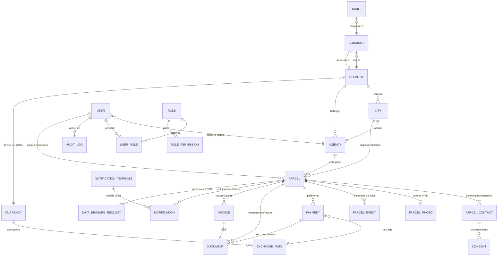
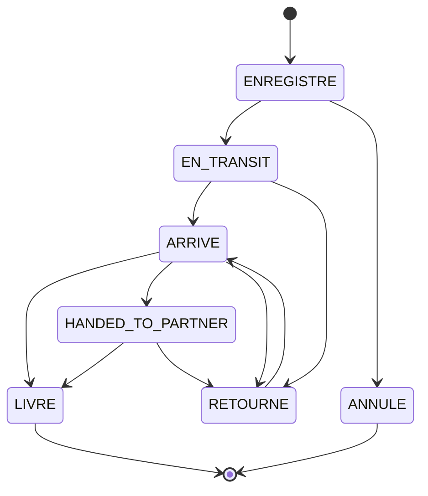
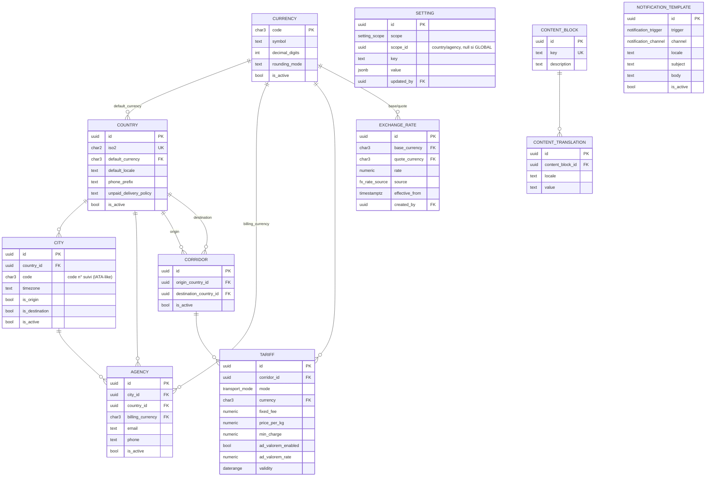
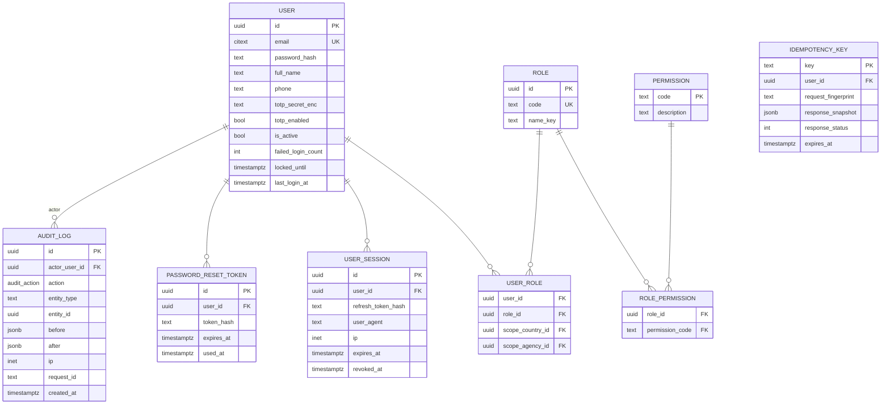
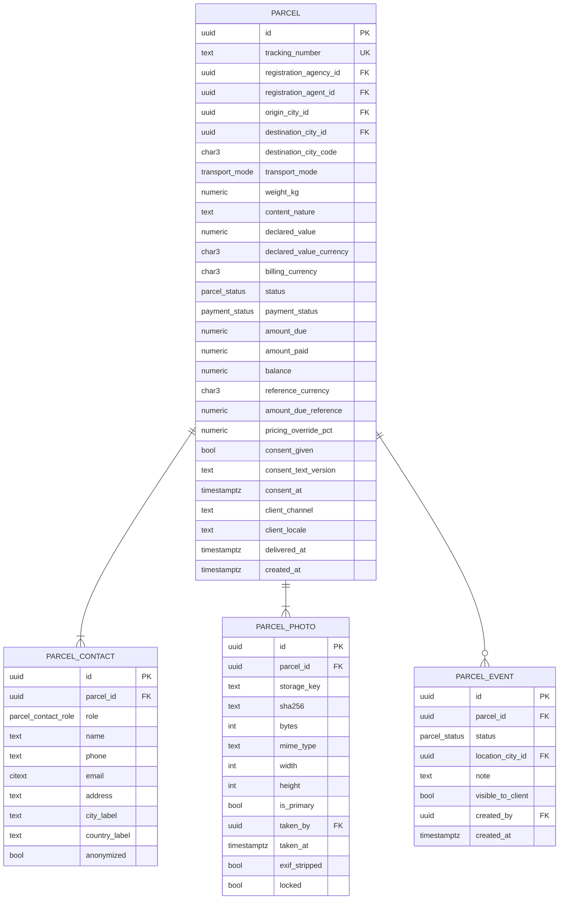
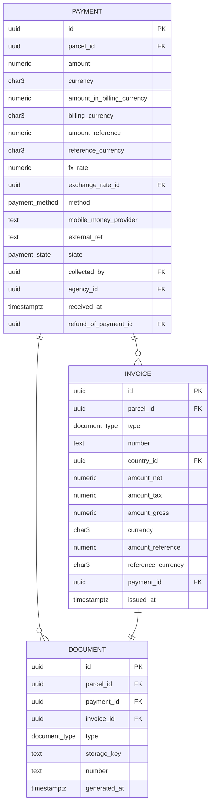

# 03 — Modèle de données / schéma de la base

Version 1.0 — 2026-09-03
SGBD cible : **PostgreSQL 16**. DDL de référence : [`../db/schema.sql`](../db/schema.sql).

---

## Table des matières

1. [Principes de modélisation](#1-principes-de-modelisation)
2. [Vue d'ensemble par domaine](#2-vue-densemble-par-domaine)
3. [Énumérations](#3-enumerations)
4. [Domaine Référentiel & Configuration](#4-domaine-referentiel--configuration)
5. [Domaine Identité & Sécurité](#5-domaine-identite--securite)
6. [Domaine Colis](#6-domaine-colis)
7. [Domaine Paiement & Facturation](#7-domaine-paiement--facturation)
8. [Domaine Notifications](#8-domaine-notifications)
9. [Domaine Séquences & Numérotation](#9-domaine-sequences--numerotation)
10. [Domaine RGPD & Rétention](#10-domaine-rgpd--retention)
11. [Vues et calculs dérivés](#11-vues-et-calculs-derives)
12. [Index et performance](#12-index-et-performance)
13. [Rétention et anonymisation](#13-retention-et-anonymisation)
14. [Jeu de données de référence (seed)](#14-jeu-de-donnees-de-reference-seed)

---

## 1. Principes de modélisation

| Principe | Règle |
|----------|-------|
| Clés primaires | `UUID` v4 (`gen_random_uuid()` via `pgcrypto`). Non énumérables ; portables entre instances régionales. |
| Horodatage | `created_at timestamptz NOT NULL DEFAULT now()`, `updated_at timestamptz NOT NULL DEFAULT now()` (trigger de mise à jour) sur toutes les tables mutables. Tout en **UTC**. |
| Suppression | **Logique** (`deleted_at timestamptz NULL`) pour les entités de configuration et les comptes. **Interdite** pour les pièces comptables, les évènements de suivi, les photos primaires, le journal d'audit (append-only). |
| Montants | `NUMERIC(18,4)` + colonne `*_currency CHAR(3)` (ISO 4217). Jamais de flottant. Décimales d'affichage portées par `currencies.decimal_digits`. |
| Conversion | Toute ligne financière stocke `amount_reference NUMERIC(18,4)`, `reference_currency CHAR(3)`, `fx_rate NUMERIC(18,8)`, `exchange_rate_id UUID`. |
| Internationalisation | Textes multilingues externalisés en tables `*_translation (…, locale, value)` ; jamais de colonne `nom_fr` / `nom_en` en dur. |
| Périmètre | `agency_id` et/ou `country_id` présents sur les entités opérationnelles pour le filtrage RBAC (et RLS optionnel). |
| Audit | `created_by UUID`, `updated_by UUID` (FK `users`) sur les entités sensibles ; le détail avant/après va dans `audit_logs`. |
| Intégrité | FK explicites, `ON DELETE RESTRICT` par défaut ; `CHECK` sur les bornes (poids > 0, montants ≥ 0) ; `citext` pour les e-mails ; `EXCLUDE` / index partiels pour l'unicité conditionnelle. |
| Idempotence | Table `idempotency_keys` (clé, empreinte de requête, réponse, expiration). |
| Concurrence | Compteurs via `INSERT … ON CONFLICT DO UPDATE … RETURNING` ; verrous `SELECT … FOR UPDATE` sur le colis lors du recalcul de solde. |
| Extensions | `pgcrypto` (UUID), `citext` (e-mails), `pg_trgm` (recherche floue), `btree_gist` (contraintes d'exclusion sur les périodes de taux/tarifs). |

---

## 2. Vue d'ensemble par domaine



Les schémas détaillés par domaine suivent dans chaque section.

---

## 3. Énumérations

Implémentées en types `ENUM` PostgreSQL (stables) ; les valeurs configurables par les
admins (devises, moyens de paiement additionnels, canaux) sont en **tables de référence**.

| Type | Valeurs | Domaine |
|------|---------|---------|
| `transport_mode` | `AIR`, `SEA` | Colis |
| `parcel_status` | `ENREGISTRE`, `EN_TRANSIT`, `ARRIVE`, `HANDED_TO_PARTNER`, `LIVRE`, `ANNULE`, `RETOURNE` | Colis — `HANDED_TO_PARTNER` ajouté par l'addendum 08 (remise à un partenaire de livraison tiers). |
| `payment_status` | `IMPAYE`, `PARTIEL`, `PAYE` | Colis (dérivé) |
| `city_status` | `HUB`, `PARTNER`, `PLANNED` | Réseau — addendum 08 §1.2. Couverture d'une ville : agence propre, partenaire tiers, ou pas encore de flux. |
| `settlement_mode` | `PER_KG`, `PERCENT_COLLECTED` | Réseau — addendum 08 §5.3. Mode de rémunération d'un partenaire de livraison. |
| `settlement_status` | `DRAFT`, `VALIDATED`, `PAID` | Réseau — addendum 08 §5.4. Cycle de vie d'un règlement partenaire. |
| `parcel_contact_role` | `SENDER`, `RECIPIENT` | Colis |
| `payment_method` | `MOBILE_MONEY`, `BANK_TRANSFER`, `CARD`, `CASH` | Paiement |
| `mobile_money_provider` | `MPESA`, `ORANGE_MONEY`, `AIRTEL_MONEY` (extensible via table) | Paiement |
| `payment_state` | `EN_ATTENTE`, `CONFIRME`, `ECHOUE`, `REMBOURSE` | Paiement |
| `document_type` | `LABEL`, `REGISTRATION_RECEIPT`, `PAYMENT_RECEIPT`, `INVOICE`, `CREDIT_NOTE` | Facturation |
| `fx_rate_source` | `MANUAL`, `API` | Devises |
| `notification_channel` | `SMS`, `WHATSAPP`, `EMAIL` | Notifications |
| `notification_status` | `FILE`, `ENVOYE`, `LIVRE`, `ECHEC` | Notifications |
| `notification_trigger` | `STATUS_CHANGE`, `PAYMENT_RECEIVED`, `UNPAID_ON_ARRIVAL`, `DUNNING_REMINDER`, `DELIVERED` | Notifications |
| `audit_action` | `CREATE`, `UPDATE`, `DELETE`, `LOGIN`, `LOGIN_FAILED`, `TRANSITION`, `REFUND`, `EXPORT`, `CONFIG_CHANGE`, `GDPR_ACCESS`, `GDPR_ERASURE` | Audit |
| `erasure_status` | `RECU`, `EN_COURS`, `TERMINE`, `REFUSE` | RGPD |
| `setting_scope` | `GLOBAL`, `COUNTRY`, `AGENCY` | Config |

**Machine à états `parcel_status`** — transitions autorisées uniquement. `ARRIVE →
HANDED_TO_PARTNER → LIVRE|RETOURNE` couvre la remise à un partenaire de livraison
tiers pour une ville `PARTNER` (addendum 08, §3.2) ; `ARRIVE → LIVRE` reste
possible directement pour une ville `HUB` :



---

## 4. Domaine Référentiel & Configuration



### `currencies`

| Colonne | Type | Contraintes | Notes |
|---------|------|-------------|-------|
| `code` | `char(3)` | PK | ISO 4217 : `XOF`, `CDF`, `USD`, `EUR`, puis `GBP`, `CNY`, `NGN`, `XAF`, `ZAR`, `RWF`, `BIF`, `TZS`… |
| `name_key` | `text` | | Clé i18n du libellé (les libellés sont dans `content_translation`). |
| `symbol` | `text` | NOT NULL | `FCFA`, `FC`, `$`, `€`… |
| `decimal_digits` | `smallint` | NOT NULL, CHECK 0–4 | `XOF`/`CDF` = 0 ; `USD`/`EUR` = 2. |
| `rounding_mode` | `text` | NOT NULL DEFAULT `HALF_UP` | `HALF_UP`, `HALF_EVEN`, `UP`, `DOWN`. |
| `is_active` | `boolean` | NOT NULL DEFAULT true | Ajout d'une devise = insérer une ligne + l'activer. |
| `is_reference` | `boolean` | NOT NULL DEFAULT false | Exactement une devise `is_reference = true` (index unique partiel). Défaut : `USD`. |
| `created_at` / `updated_at` | `timestamptz` | | |

### `countries`

| Colonne | Type | Contraintes | Notes |
|---------|------|-------------|-------|
| `id` | `uuid` | PK | |
| `iso2` | `char(2)` | UNIQUE, NOT NULL | `BJ`, `CD`, `CG`, `ZA`, `RW`, `BI`, `TZ`, `FR`, `CN`, `NG`. |
| `name_key` | `text` | NOT NULL | i18n. |
| `default_currency` | `char(3)` | FK `currencies.code`, NOT NULL | |
| `default_locale` | `text` | NOT NULL | `fr`, `en`, `zh`, `sw`, `ln`. |
| `phone_prefix` | `text` | | `+229`, `+243`… |
| `tax_rate` | `numeric(6,4)` | NOT NULL DEFAULT 0 | TVA/taxe par défaut (Q13). |
| `unpaid_delivery_policy` | `text` | NOT NULL DEFAULT `derogation` | `strict` \| `derogation` (RG-08). |
| `data_residency_region` | `text` | | Région d'hébergement applicable (RGPD). |
| `is_active` | `boolean` | NOT NULL DEFAULT true | |
| `deleted_at` | `timestamptz` | NULL | |

### `cities`

| Colonne | Type | Contraintes | Notes |
|---------|------|-------------|-------|
| `id` | `uuid` | PK | |
| `country_id` | `uuid` | FK `countries.id`, NOT NULL | |
| `code` | `char(3)` | NOT NULL | Code inséré dans le numéro de suivi (`FIH`, `COO`, `BZV`, `JNB`, `KGL`, `BJM`, `DAR`, `CDG`, `PVG`, `LOS`…). Unicité **globale** recommandée : `UNIQUE (code)` (à confirmer si collision possible → `UNIQUE (country_id, code)` + code pays dans le n° de suivi). |
| `name_key` | `text` | NOT NULL | i18n. |
| `timezone` | `text` | NOT NULL | IANA (`Africa/Kinshasa`, `Europe/Paris`, `Asia/Shanghai`). |
| `status` | `city_status` | NOT NULL DEFAULT `PLANNED` | Addendum 08, §1.2 — `HUB` (agence propre), `PARTNER` (livraison via un ou plusieurs `delivery_partners`, dernière étape hors agence Okapi), `PLANNED` (identifiée, aucun flux). Une ville n'implique pas forcément une agence : cf. `delivery_partners` ci-dessous. |
| `is_origin` | `boolean` | NOT NULL DEFAULT true | Proposée comme ville de départ. |
| `is_destination` | `boolean` | NOT NULL DEFAULT true | Proposée comme ville de destination. |
| `is_active` | `boolean` | NOT NULL DEFAULT true | |
| `deleted_at` | `timestamptz` | NULL | |

### `agencies`

| Colonne | Type | Contraintes | Notes |
|---------|------|-------------|-------|
| `id` | `uuid` | PK | |
| `code` | `text` | UNIQUE, NOT NULL | Code court agence (reporting, pièces). |
| `name` | `text` | NOT NULL | |
| `city_id` | `uuid` | FK `cities.id`, NOT NULL | |
| `country_id` | `uuid` | FK `countries.id`, NOT NULL | Dénormalisé pour le périmètre. |
| `billing_currency` | `char(3)` | FK `currencies.code`, NOT NULL | Devise de facturation par défaut des colis de l'agence (RG-02). |
| `address` | `text` | | Configurable (EF-CFG-01). |
| `email` | `citext` | | |
| `phone` | `text` | | |
| `timezone` | `text` | NOT NULL | Hérité de la ville, surchargeable. |
| `is_active` | `boolean` | NOT NULL DEFAULT true | |
| `deleted_at` | `timestamptz` | NULL | |

### `corridors`

| Colonne | Type | Contraintes | Notes |
|---------|------|-------------|-------|
| `id` | `uuid` | PK | |
| `origin_country_id` | `uuid` | FK `countries.id`, NOT NULL | |
| `destination_country_id` | `uuid` | FK `countries.id`, NOT NULL | |
| `label_key` | `text` | | i18n (ex. « Bénin → RDC »). |
| `is_active` | `boolean` | NOT NULL DEFAULT true | |
| | | UNIQUE `(origin_country_id, destination_country_id)` | |

> Le tarif peut aussi être défini à la maille ville→ville : `tariffs` référence un
> `corridor_id` **ou** un couple `(origin_city_id, destination_city_id)` (l'un des deux
> renseigné). Le calcul choisit d'abord la règle ville→ville, puis le corridor pays.

### `tariffs`

| Colonne | Type | Contraintes | Notes |
|---------|------|-------------|-------|
| `id` | `uuid` | PK | |
| `corridor_id` | `uuid` | FK `corridors.id` NULL | |
| `origin_city_id` | `uuid` | FK `cities.id` NULL | Règle ville→ville prioritaire. |
| `destination_city_id` | `uuid` | FK `cities.id` NULL | |
| `mode` | `transport_mode` | NOT NULL | |
| `currency` | `char(3)` | FK `currencies.code`, NOT NULL | Devise de la grille. |
| `fixed_fee` | `numeric(18,4)` | NOT NULL DEFAULT 0, CHECK ≥ 0 | Frais fixes. |
| `price_per_kg` | `numeric(18,4)` | NOT NULL DEFAULT 0, CHECK ≥ 0 | |
| `min_charge` | `numeric(18,4)` | NOT NULL DEFAULT 0, CHECK ≥ 0 | Montant plancher. |
| `ad_valorem_enabled` | `boolean` | NOT NULL DEFAULT false | Règle « ad valorem » (RG-13, Q6). |
| `ad_valorem_rate` | `numeric(6,4)` | NOT NULL DEFAULT 0 | % de la valeur déclarée. |
| `override_min` | `numeric(6,4)` | NOT NULL DEFAULT 0 | Fourchette de dérogation agent (EF-ENR-09) : `-x %`. |
| `override_max` | `numeric(6,4)` | NOT NULL DEFAULT 0 | `+x %`. |
| `validity` | `daterange` | NOT NULL DEFAULT `[today,)` | Période de validité. |
| `created_by` | `uuid` | FK `users.id` | |
| | | EXCLUDE (chevauchement de `validity` pour un même triplet cible+mode) via `btree_gist` | Empêche deux tarifs actifs simultanés. |

> **Note d'intégration (addendum 08, §2)** : le document complémentaire nomme ce
> besoin « `RouteTariff` ». C'est exactement le rôle déjà tenu par `tariffs` avec
> `(origin_city_id, destination_city_id)` renseignés — aucune table
> supplémentaire n'a donc été créée pour ce volet. Pour une destination
> `PARTNER`, `tariffs` couvre le trajet principal jusqu'au hub le plus proche ;
> la dernière étape (hub → destinataire) est facturée séparément via
> `partner_tariffs` ci-dessous et sommée au montant dû (§6, `parcels`).

### `delivery_partners`

Partenaire de livraison tiers assurant la dernière étape pour une ville
`PARTNER` — addendum 08, §1.4. Une ville n'a pas d'agence Okapi dans ce cas ;
plusieurs partenaires actifs peuvent desservir la même ville avec des zones
et des tarifs différents (pas de contrainte d'unicité sur `city_id`).

| Colonne | Type | Contraintes | Notes |
|---------|------|-------------|-------|
| `id` | `uuid` | PK | |
| `city_id` | `uuid` | FK `cities.id`, NOT NULL | Ville desservie (statut `PARTNER`). |
| `name` | `text` | NOT NULL | Raison sociale du partenaire. |
| `coverage_zone` | `text` | NULL | Zone desservie précise (ex. « axe Kolwezi-Fungurume »), utile quand plusieurs partenaires se partagent une province. |
| `contact_name` / `contact_phone` / `contact_email` | `text` | NULL | |
| `commission_pct` | `numeric(6,4)` | NULL | Utilisé si `settlement_mode = PERCENT_COLLECTED`. |
| `settlement_mode` | `settlement_mode` | NOT NULL DEFAULT `PER_KG` | Détermine le calcul de `partner_settlements` (§5.3 de l'addendum). |
| `reliability_note` | `text` | NULL | Délai moyen constaté, fiabilité observée — aide au choix agent. |
| `is_preferred` | `boolean` | NOT NULL DEFAULT false | Partenaire proposé par défaut à la création d'un colis pour cette ville ; un seul actif par ville (appliqué côté service). |
| `is_active` | `boolean` | NOT NULL DEFAULT true | |

### `partner_tariffs`

Tarif de la dernière étape (hub → destinataire) **par partenaire** — addendum
08, §1.5. Deux partenaires d'une même ville peuvent facturer différemment ;
même logique de versionnement datée que `tariffs` (nouvelle ligne + clôture
de la précédente, pas d'`EXCLUDE` en base pour ce volet en v1).

| Colonne | Type | Contraintes | Notes |
|---------|------|-------------|-------|
| `id` | `uuid` | PK | |
| `delivery_partner_id` | `uuid` | FK `delivery_partners.id`, NOT NULL | |
| `price_per_kg` | `numeric(18,4)` | NOT NULL, CHECK ≥ 0 | |
| `currency_code` | `char(3)` | FK `currencies.code`, NOT NULL | |
| `min_weight_kg` | `numeric(10,2)` | NULL | Poids minimum facturé (non appliqué au calcul du montant en v1 — voir registre des décisions). |
| `is_active` | `boolean` | NOT NULL DEFAULT true | |
| `effective_from` / `effective_to` | `date` | `effective_from` NOT NULL | |

### `partner_settlements`

Réconciliation périodique des commissions dues à un partenaire — addendum
08, §5. Générée depuis les colis `LIVRE` du partenaire sur la période (pas de
table de liaison colis↔règlement en v1 : le détail est recalculé à la
demande avec les mêmes critères que la génération).

| Colonne | Type | Contraintes | Notes |
|---------|------|-------------|-------|
| `id` | `uuid` | PK | |
| `delivery_partner_id` | `uuid` | FK `delivery_partners.id`, NOT NULL | |
| `period_start` / `period_end` | `date` | NOT NULL | |
| `parcel_count` | `integer` | NOT NULL | |
| `total_collected_amount` | `numeric(18,4)` | NOT NULL | Somme des `amount_paid` des colis inclus. |
| `commission_amount` | `numeric(18,4)` | NOT NULL | `price_per_kg × poids` (PER_KG) ou `commission_pct × total_collected_amount` (PERCENT_COLLECTED). |
| `currency_code` | `char(3)` | FK `currencies.code`, NOT NULL | |
| `status` | `settlement_status` | NOT NULL DEFAULT `DRAFT` | `DRAFT` (généré) → `VALIDATED` (DAF) → `PAID` (virement effectué). |
| `validated_by_user_id` | `uuid` | FK `users.id` NULL | |
| `paid_at` | `timestamptz` | NULL | |
| `payment_reference` | `text` | NULL | |

### `exchange_rates`

| Colonne | Type | Contraintes | Notes |
|---------|------|-------------|-------|
| `id` | `uuid` | PK | |
| `base_currency` | `char(3)` | FK `currencies.code`, NOT NULL | Devise « 1 unité de ». |
| `quote_currency` | `char(3)` | FK `currencies.code`, NOT NULL | En pratique = devise de référence (pivot). |
| `rate` | `numeric(18,8)` | NOT NULL, CHECK > 0 | 1 `base` = `rate` `quote`. |
| `source` | `fx_rate_source` | NOT NULL | `MANUAL` / `API`. |
| `provider` | `text` | | Nom de l'API (si `API`). |
| `effective_from` | `timestamptz` | NOT NULL | Historisation ; jamais d'`UPDATE`. |
| `created_by` | `uuid` | FK `users.id` NULL | NULL si import automatique. |
| `created_at` | `timestamptz` | | |
| | | UNIQUE `(base_currency, quote_currency, effective_from)` | |
| | | INDEX `(base_currency, quote_currency, effective_from DESC)` | Lookup du taux applicable. |

### `settings`

| Colonne | Type | Contraintes | Notes |
|---------|------|-------------|-------|
| `id` | `uuid` | PK | |
| `scope` | `setting_scope` | NOT NULL | `GLOBAL` / `COUNTRY` / `AGENCY`. |
| `scope_id` | `uuid` | NULL | `countries.id` ou `agencies.id` ; NULL si `GLOBAL`. |
| `key` | `text` | NOT NULL | `brand.primary_color`, `brand.logo_url`, `contact.email`, `contact.phone`, `social.facebook`, `footer.slogan`, `tracking.sequence_scope`, `fx.reference_currency`, `fx.stale_hours`, `dunning.schedule_days`… |
| `value` | `jsonb` | NOT NULL | Valeur typée. |
| `updated_by` | `uuid` | FK `users.id` | |
| `updated_at` | `timestamptz` | | |
| | | UNIQUE `(scope, scope_id, key)` | Résolution : AGENCY → COUNTRY → GLOBAL. |

> Les **secrets** (clés d'API fournisseurs SMS/WhatsApp/e-mail/FX) ne sont **pas** dans
> `settings` : ils vivent dans le coffre de secrets (cf. architecture § 10). `settings` ne
> contient que de la configuration non sensible, éditable par la Direction.

### `content_blocks` / `content_translations`

Textes éditables du site public et des e-mails non transactionnels.

| `content_blocks` | Type | Notes |
|------------------|------|-------|
| `id` `uuid` PK | | |
| `key` `text` UNIQUE | | `public.home.title`, `public.legal.privacy`, `public.footer.slogan`… |
| `description` `text` | | Aide à l'édition. |

| `content_translations` | Type | Notes |
|------------------------|------|-------|
| `id` `uuid` PK | | |
| `content_block_id` `uuid` FK | | |
| `locale` `text` NOT NULL | | `fr`, `en`, `zh`, `sw`, `ln`… |
| `value` `text` NOT NULL | | Contenu (Markdown autorisé pour les blocs longs). |
| `updated_by` `uuid` FK `users.id` | | |
| UNIQUE `(content_block_id, locale)` | | |

### `notification_templates`

| Colonne | Type | Notes |
|---------|------|-------|
| `id` `uuid` | PK | |
| `trigger` `notification_trigger` | NOT NULL | |
| `channel` `notification_channel` | NOT NULL | |
| `locale` `text` | NOT NULL | |
| `subject` `text` | | E-mail uniquement. |
| `body` `text` | NOT NULL | Gabarit avec variables `{{numero_suivi}}`, `{{statut}}`, `{{ville_destination}}`, `{{lien_suivi}}`, `{{solde}}`… |
| `is_active` `boolean` | NOT NULL DEFAULT true | |
| UNIQUE `(trigger, channel, locale)` | | |

---

## 5. Domaine Identité & Sécurité



### `users`

| Colonne | Type | Contraintes | Notes |
|---------|------|-------------|-------|
| `id` | `uuid` | PK | |
| `email` | `citext` | UNIQUE, NOT NULL | Identifiant de connexion. |
| `password_hash` | `text` | NOT NULL | **Argon2id**. |
| `full_name` | `text` | NOT NULL | |
| `phone` | `text` | | |
| `default_locale` | `text` | NOT NULL DEFAULT `fr` | Langue de l'interface. |
| `totp_secret_enc` | `text` | NULL | Secret TOTP chiffré (enveloppe KMS). |
| `totp_enabled` | `boolean` | NOT NULL DEFAULT false | Obligatoire pour DAF/super-admin (contrôle applicatif). |
| `is_active` | `boolean` | NOT NULL DEFAULT true | Désactivation = révocation d'accès. |
| `failed_login_count` | `integer` | NOT NULL DEFAULT 0 | |
| `locked_until` | `timestamptz` | NULL | Verrouillage progressif. |
| `last_login_at` | `timestamptz` | NULL | |
| `created_by` / `updated_by` | `uuid` | FK `users.id` | |
| `created_at` / `updated_at` / `deleted_at` | `timestamptz` | | |

### `roles`

| Colonne | Type | Notes |
|---------|------|-------|
| `id` `uuid` | PK | |
| `code` `text` | UNIQUE | `AGENT_FRET`, `ADMIN_DAF`, `SUPER_ADMIN` (extensible). |
| `name_key` `text` | | i18n. |
| `is_system` `boolean` | DEFAULT false | Rôles non supprimables. |

### `permissions`

Table de référence en lecture (peuplée par migration). `code` `text` PK, `description` `text`.
Exemples : `parcel:create`, `parcel:update`, `parcel:transition`, `parcel:photo:write`,
`payment:create`, `payment:refund`, `report:read`, `report:export`, `tariff:write`,
`fx:write`, `config:write`, `city:write`, `currency:write`, `user:manage`, `audit:read`,
`gdpr:manage`.

> **Addendum 08, §4** — `parcel:transition` couvrait jusque-là *toute*
> transition de statut. Pour un contrôle fin et un audit clair de la
> réception/livraison, deux permissions dédiées s'y ajoutent :
> - `parcel:arrival:confirm` — signale l'arrivée physique au hub/agence de
>   destination (`ARRIVE`), avant tout retrait client.
> - `parcel:deliver:confirm` — constate le retrait client et l'encaissement
>   (`LIVRE`), verrouille le dossier.
>
> `parcel:transition` reste utilisé pour les étapes intermédiaires
> (`EN_TRANSIT`, `RETOURNE`, `HANDED_TO_PARTNER`). Un agent qui n'a pas
> `payment:create` ne peut donc pas finaliser une livraison encaissée, mais
> peut signaler une simple arrivée. Deux permissions supplémentaires
> couvrent la réconciliation des partenaires (§4 ci-dessous) :
> `settlement:read`, `settlement:write`.

### `role_permissions`

`(role_id uuid FK, permission_code text FK)`, PK composite. Attribution par défaut :

| Rôle | Permissions (extrait) |
|------|-----------------------|
| `AGENT_FRET` | `parcel:*` (hors delete), `payment:create`, `document:read`, `parcel:transition`, `parcel:arrival:confirm`, `parcel:deliver:confirm` (agence). |
| `ADMIN_DAF` | lecture globale, `payment:refund`, `report:*`, `tariff:write`, `fx:write`, `audit:read`, `export:*`, `parcel:arrival:confirm`, `parcel:deliver:confirm` (correction), `settlement:read`, `settlement:write`. |
| `SUPER_ADMIN` | tout, dont `user:manage`, `config:write`, `city:write`, `currency:write`, `gdpr:manage`. |

> **Rôle différé (addendum 08, §4.3, option B)** : un rôle `AGENT_PARTENAIRE`
> à permissions restreintes (`parcel:arrival:confirm` + `parcel:deliver:confirm`
> uniquement, pas d'accès aux rapports ni à la création de colis), avec un
> compte par partenaire, est envisagé pour donner un accès direct aux
> partenaires à fort volume plutôt que de faire remonter l'information à
> l'agent du hub. Non retenu pour la v1 (voir `00-registre-decisions.md`,
> décision D16) — la permission `parcel:arrival:confirm`/`parcel:deliver:confirm`
> étant déjà distincte de `parcel:transition`, l'ajout de ce rôle plus tard ne
> nécessitera aucune migration de permissions, seulement une nouvelle ligne
> `roles` + `role_permissions`.

### `user_roles`

| Colonne | Type | Notes |
|---------|------|-------|
| `user_id` `uuid` | FK `users.id` | |
| `role_id` `uuid` | FK `roles.id` | |
| `scope_country_id` `uuid` | FK `countries.id` NULL | Périmètre pays (NULL = tous, si rôle global). |
| `scope_agency_id` `uuid` | FK `agencies.id` NULL | Périmètre agence (obligatoire pour `AGENT_FRET`). |
| PK `(user_id, role_id, coalesce(scope_country_id), coalesce(scope_agency_id))` | | Un même rôle peut être accordé sur plusieurs périmètres. |

### `user_sessions`

Refresh tokens rotatifs. `refresh_token_hash` (SHA-256 du jeton opaque), `expires_at`,
`revoked_at`, `replaced_by_id` (chaînage de rotation), `ip`, `user_agent`.

### `password_reset_tokens`

`token_hash`, `expires_at` (≤ 1 h), `used_at`. À usage unique.

### `audit_logs` (append-only)

| Colonne | Type | Notes |
|---------|------|-------|
| `id` `uuid` | PK | |
| `actor_user_id` `uuid` | FK `users.id` NULL | NULL pour les jobs système. |
| `actor_label` `text` | | `system:dunning`, `system:fx-sync`… |
| `action` `audit_action` | NOT NULL | |
| `entity_type` `text` | NOT NULL | `parcel`, `payment`, `tariff`, `exchange_rate`, `user_role`, `setting`… |
| `entity_id` `uuid` | NULL | |
| `before` `jsonb` | NULL | État avant (PII expurgées). |
| `after` `jsonb` | NULL | État après (PII expurgées). |
| `ip` `inet` | NULL | |
| `request_id` `text` | NULL | Corrélation logs. |
| `created_at` `timestamptz` | NOT NULL DEFAULT now() | |

Droits DB : `INSERT`/`SELECT` seulement pour le rôle applicatif ; `UPDATE`/`DELETE` révoqués.
Partitionnement mensuel par `created_at` (rétention ≥ 5 ans).

### `idempotency_keys`

`key` (fourni par le client, PK), `user_id`, `request_fingerprint` (hash méthode+chemin+corps),
`response_status`, `response_snapshot jsonb`, `expires_at` (24 h). Rejoue la réponse si la
même clé + empreinte revient ; conflit `409` si clé identique mais corps différent.

---

## 6. Domaine Colis



### `parcels`

| Colonne | Type | Contraintes | Notes |
|---------|------|-------------|-------|
| `id` | `uuid` | PK | |
| `tracking_number` | `text` | UNIQUE, NOT NULL | `OKP` + `AAMM` + séquentiel + code ville. Jamais réattribué. Index `citext`/`upper()` pour la recherche insensible à la casse. |
| `registration_agency_id` | `uuid` | FK `agencies.id`, NOT NULL | Périmètre. |
| `registration_agent_id` | `uuid` | FK `users.id`, NOT NULL | |
| `origin_city_id` | `uuid` | FK `cities.id`, NOT NULL | |
| `destination_city_id` | `uuid` | FK `cities.id`, NOT NULL | |
| `destination_city_code` | `char(3)` | NOT NULL | Figé (traçabilité du n° de suivi même si la ville est renommée). |
| `destination_agency_id` | `uuid` | FK `agencies.id` NULL | Addendum 08, §3.1 — agence de destination si `destination_city.status = HUB` (résolue automatiquement à la création). Sert de base au contrôle de périmètre de `parcel:arrival:confirm`/`parcel:deliver:confirm`. |
| `transit_agency_id` | `uuid` | FK `agencies.id` NULL | Agence intermédiaire en cas de transbordement. |
| `delivery_partner_id` | `uuid` | FK `delivery_partners.id` NULL | Addendum 08, §1.4/§3.1 — partenaire retenu si `destination_city.status = PARTNER` (préféré auto-sélectionné, ou choisi par l'agent). Modifiable à la remise (`HANDED_TO_PARTNER`) si la zone du destinataire l'exige. |
| `transport_mode` | `transport_mode` | NOT NULL | |
| `weight_kg` | `numeric(10,2)` | NOT NULL, CHECK > 0 | |
| `content_nature` | `text` | NOT NULL | Donnée potentiellement sensible → non exposée au public. |
| `declared_value` | `numeric(18,4)` | NOT NULL DEFAULT 0, CHECK ≥ 0 | |
| `declared_value_currency` | `char(3)` | FK `currencies.code`, NOT NULL | |
| `billing_currency` | `char(3)` | FK `currencies.code`, NOT NULL | RG-02 ; figée après 1er paiement confirmé. |
| `status` | `parcel_status` | NOT NULL DEFAULT `ENREGISTRE` | Machine à états (RG-07). |
| `payment_status` | `payment_status` | NOT NULL DEFAULT `IMPAYE` | **Dérivé** (RG-03), matérialisé pour le filtrage. |
| `amount_due` | `numeric(18,4)` | NOT NULL, CHECK ≥ 0 | En `billing_currency`. |
| `amount_paid` | `numeric(18,4)` | NOT NULL DEFAULT 0, CHECK ≥ 0 | Somme des paiements confirmés, en `billing_currency`. |
| `balance` | `numeric(18,4)` | `GENERATED ALWAYS AS (amount_due - amount_paid) STORED` | Solde restant. |
| `reference_currency` | `char(3)` | FK `currencies.code`, NOT NULL | Copie de la devise de référence au moment T. |
| `amount_due_reference` | `numeric(18,4)` | NOT NULL | `amount_due` converti (consolidation). |
| `fx_rate_due` | `numeric(18,8)` | NOT NULL | Taux `billing→reference` figé à l'enregistrement. |
| `exchange_rate_id_due` | `uuid` | FK `exchange_rates.id` NULL | |
| `pricing_override_pct` | `numeric(6,4)` | NOT NULL DEFAULT 0 | Dérogation agent appliquée (EF-ENR-09) ; tracée si ≠ 0. |
| `pricing_snapshot` | `jsonb` | NOT NULL | Détail du calcul (tarif appliqué, frais fixes, prix/kg, min, ad valorem). Preuve. Contient une clé `partnerLeg` (tarif du partenaire, montant de la dernière étape) quand `delivery_partner_id` est renseigné — addendum 08, §1.5. |
| `consent_given` | `boolean` | NOT NULL DEFAULT false | RG-14. |
| `consent_text_version` | `text` | | Version des mentions acceptées. |
| `consent_at` | `timestamptz` | | |
| `client_channel` | `notification_channel` | NULL | Canal de notification préféré du client. |
| `client_locale` | `text` | NOT NULL DEFAULT `fr` | Langue des notifications. |
| `cancel_reason` | `text` | NULL | Obligatoire si `ANNULE`. |
| `delivered_at` | `timestamptz` | NULL | |
| `country_id` | `uuid` | FK `countries.id`, NOT NULL | Dénormalisé (périmètre / reporting). |
| `created_by` / `updated_by` | `uuid` | | |
| `created_at` / `updated_at` | `timestamptz` | | Pas de `deleted_at` : un colis ne se supprime pas (annulation seulement). |

**Contraintes / règles applicatives :**
- `CHECK (status <> 'ANNULE' OR cancel_reason IS NOT NULL)`.
- `CHECK (payment_status = 'PAYE') = (amount_paid >= amount_due AND amount_due > 0)` — matérialisation vérifiée par trigger plutôt que CHECK strict (tolérance amount_due = 0).
- Passage à `LIVRE` avec `balance > 0` : autorisé seulement via endpoint dédié + `override` tracé (RG-08), selon `countries.unpaid_delivery_policy`.
- `billing_currency` non modifiable si un `payments.state = 'CONFIRME'` existe.

### `parcel_contacts`

| Colonne | Type | Contraintes | Notes |
|---------|------|-------------|-------|
| `id` | `uuid` | PK | |
| `parcel_id` | `uuid` | FK `parcels.id` ON DELETE CASCADE, NOT NULL | |
| `role` | `parcel_contact_role` | NOT NULL | `SENDER` / `RECIPIENT`. |
| `name` | `text` | NOT NULL | PII. |
| `phone` | `text` | | PII. |
| `email` | `citext` | | PII, facultatif. |
| `address` | `text` | | PII. |
| `city_label` | `text` | | Ville libre (peut différer du référentiel). |
| `country_label` | `text` | | |
| `id_document_ref` | `text` | NULL | Réf. pièce d'identité si exigée localement (PII sensible ; chiffrée applicativement). |
| `anonymized` | `boolean` | NOT NULL DEFAULT false | Passe à true après effacement RGPD ; champs PII → `REDACTED`. |
| `anonymized_at` | `timestamptz` | NULL | |
| UNIQUE `(parcel_id, role)` | | | Un expéditeur + un destinataire par colis. |

> Séparer les contacts du colis facilite l'**anonymisation RGPD** sans toucher aux données
> comptables du colis.

### `parcel_photos`

| Colonne | Type | Contraintes | Notes |
|---------|------|-------------|-------|
| `id` | `uuid` | PK | |
| `parcel_id` | `uuid` | FK `parcels.id`, NOT NULL | |
| `storage_key` | `text` | NOT NULL, UNIQUE | Clé objet (bucket privé). |
| `derivative_keys` | `jsonb` | | `{ "thumb": "...", "web": "..." }`. |
| `sha256` | `char(64)` | NOT NULL | Empreinte de l'original (preuve). |
| `bytes` | `integer` | NOT NULL | |
| `mime_type` | `text` | NOT NULL | `image/jpeg`, `image/webp`. |
| `width` / `height` | `integer` | | Renseignés par le worker. |
| `is_primary` | `boolean` | NOT NULL DEFAULT false | ≥ 1 par colis à la validation (EF-ENR-04). Index unique partiel `(parcel_id) WHERE is_primary`. |
| `taken_by` | `uuid` | FK `users.id`, NOT NULL | Agent. |
| `taken_at` | `timestamptz` | NOT NULL DEFAULT now() | Horodatage serveur (fait foi). |
| `exif_stripped` | `boolean` | NOT NULL DEFAULT false | Passe à true après traitement. |
| `locked` | `boolean` | NOT NULL DEFAULT false | true dès `EN_TRANSIT` : non remplaçable/supprimable (EF-ENR-06). |
| `created_at` | `timestamptz` | | Pas de suppression (sauf RGPD, tracée). |

### `parcel_events`

| Colonne | Type | Contraintes | Notes |
|---------|------|-------------|-------|
| `id` | `uuid` | PK | |
| `parcel_id` | `uuid` | FK `parcels.id`, NOT NULL | |
| `status` | `parcel_status` | NOT NULL | Statut atteint. |
| `location_city_id` | `uuid` | FK `cities.id` NULL | Lieu de l'étape. |
| `location_label` | `text` | NULL | Lieu libre si hors référentiel. |
| `note` | `text` | NULL | Commentaire agent. |
| `visible_to_client` | `boolean` | NOT NULL DEFAULT true | Filtre l'historique public. |
| `created_by` | `uuid` | FK `users.id` NULL | NULL si système. |
| `created_at` | `timestamptz` | NOT NULL DEFAULT now() | Append-only. |
| INDEX `(parcel_id, created_at)` | | | Timeline. |

---

## 7. Domaine Paiement & Facturation



### `payments`

| Colonne | Type | Contraintes | Notes |
|---------|------|-------------|-------|
| `id` | `uuid` | PK | |
| `parcel_id` | `uuid` | FK `parcels.id`, NOT NULL | |
| `amount` | `numeric(18,4)` | NOT NULL, CHECK > 0 | Montant **dans la devise saisie**. |
| `currency` | `char(3)` | FK `currencies.code`, NOT NULL | Peut différer de `billing_currency` (EF-PAY-05). |
| `amount_in_billing_currency` | `numeric(18,4)` | NOT NULL | `amount` converti vers `parcels.billing_currency`. |
| `billing_currency` | `char(3)` | NOT NULL | Copie pour lisibilité/immuabilité. |
| `amount_reference` | `numeric(18,4)` | NOT NULL | `amount` converti vers la devise de référence. |
| `reference_currency` | `char(3)` | NOT NULL | |
| `fx_rate` | `numeric(18,8)` | NOT NULL | Taux `currency → reference` figé (EF-DEV-05). 1 si identiques. |
| `fx_rate_to_billing` | `numeric(18,8)` | NOT NULL | Taux `currency → billing` figé. |
| `exchange_rate_id` | `uuid` | FK `exchange_rates.id` NULL | Ligne de taux utilisée (NULL si taux manuel exceptionnel consigné dans `pricing_snapshot`). |
| `method` | `payment_method` | NOT NULL | `MOBILE_MONEY`, `BANK_TRANSFER`, `CARD`, `CASH`. |
| `mobile_money_provider` | `text` | NULL | `MPESA` / `ORANGE_MONEY` / `AIRTEL_MONEY`… (obligatoire si `method = MOBILE_MONEY`). |
| `external_ref` | `text` | NULL | Référence de transaction (Mobile Money, banque, TPE). |
| `state` | `payment_state` | NOT NULL DEFAULT `EN_ATTENTE` | Seul `CONFIRME` compte dans le solde (EF-PAY-12). `CASH` peut être `CONFIRME` d'emblée. |
| `confirmed_at` | `timestamptz` | NULL | |
| `failure_reason` | `text` | NULL | |
| `refund_of_payment_id` | `uuid` | FK `payments.id` NULL | Renseigné pour un remboursement (montant négatif logique → stocké positif avec `state = REMBOURSE` sur l'original + ligne d'avoir). |
| `refund_reason` | `text` | NULL | Obligatoire pour un remboursement (EF-PAY-09). |
| `collected_by` | `uuid` | FK `users.id`, NOT NULL | Agent encaisseur. |
| `agency_id` | `uuid` | FK `agencies.id`, NOT NULL | Périmètre + reporting encaissement. |
| `country_id` | `uuid` | FK `countries.id`, NOT NULL | Dénormalisé. |
| `received_at` | `timestamptz` | NOT NULL DEFAULT now() | Date d'encaissement déclarée. |
| `idempotency_key` | `text` | NULL | Lien vers `idempotency_keys` (double soumission). |
| `created_by` | `uuid` | | |
| `created_at` / `updated_at` | `timestamptz` | | Ligne **immuable** hors passage d'état ; corrections par ajustement/avoir (EF-PAY-06). |
| INDEX `(parcel_id, received_at)` ; `(agency_id, received_at)` ; `(state)` ; `(method)` | | | Historique + reporting. |

**Trigger `recompute_parcel_balance`** (AFTER INSERT/UPDATE OF state ON payments) :
recalcule `parcels.amount_paid` (Σ `amount_in_billing_currency` des paiements `CONFIRME`
moins remboursements), `parcels.payment_status`, verrouille le colis en `SELECT … FOR UPDATE`.

### `invoices` (pièces comptables — reçus, factures, avoirs)

| Colonne | Type | Contraintes | Notes |
|---------|------|-------------|-------|
| `id` | `uuid` | PK | |
| `parcel_id` | `uuid` | FK `parcels.id`, NOT NULL | |
| `type` | `document_type` | NOT NULL | `REGISTRATION_RECEIPT`, `PAYMENT_RECEIPT`, `INVOICE`, `CREDIT_NOTE`. |
| `number` | `text` | NOT NULL | Numéro séquentiel continu par pays (RG-09). UNIQUE `(country_id, type, number)`. |
| `country_id` | `uuid` | FK `countries.id`, NOT NULL | Détermine la séquence et les mentions légales. |
| `payment_id` | `uuid` | FK `payments.id` NULL | Renseigné pour un reçu de paiement / avoir. |
| `amount_net` | `numeric(18,4)` | NOT NULL | |
| `amount_tax` | `numeric(18,4)` | NOT NULL DEFAULT 0 | `country.tax_rate` (Q13). |
| `amount_gross` | `numeric(18,4)` | NOT NULL | |
| `currency` | `char(3)` | NOT NULL | Devise de la pièce (= `billing_currency` du colis en général). |
| `amount_reference` | `numeric(18,4)` | NOT NULL | Contre-valeur devise de référence. |
| `reference_currency` | `char(3)` | NOT NULL | |
| `fx_rate` | `numeric(18,8)` | NOT NULL | |
| `issued_at` | `timestamptz` | NOT NULL DEFAULT now() | |
| `issued_by` | `uuid` | FK `users.id` NULL | NULL si générée par le système. |
| `legal_mentions_snapshot` | `jsonb` | NOT NULL | Émetteur, coordonnées, taux, mentions — figés (immuabilité). |
| `created_at` | `timestamptz` | | **Aucune** mise à jour ni suppression (append-only). Une erreur se corrige par un avoir. |

### `documents` (fichiers PDF générés)

| Colonne | Type | Notes |
|---------|------|-------|
| `id` `uuid` | PK | |
| `parcel_id` `uuid` | FK NOT NULL | |
| `payment_id` `uuid` | FK NULL | |
| `invoice_id` `uuid` | FK NULL | Lien vers la pièce comptable si applicable. |
| `type` `document_type` | NOT NULL | `LABEL`, `REGISTRATION_RECEIPT`, `PAYMENT_RECEIPT`, `INVOICE`, `CREDIT_NOTE`. |
| `storage_key` `text` | NOT NULL, UNIQUE | Objet PDF (bucket privé). |
| `number` `text` | NULL | Reprise du numéro de pièce. |
| `checksum_sha256` `char(64)` | | Intégrité. |
| `generated_at` `timestamptz` | NOT NULL DEFAULT now() | |
| `created_at` `timestamptz` | | |

---

## 8. Domaine Notifications

### `notifications` (journal des envois)

| Colonne | Type | Contraintes | Notes |
|---------|------|-------------|-------|
| `id` | `uuid` | PK | |
| `parcel_id` | `uuid` | FK `parcels.id` NULL | NULL possible pour notifications internes. |
| `trigger` | `notification_trigger` | NOT NULL | |
| `channel` | `notification_channel` | NOT NULL | |
| `template_id` | `uuid` | FK `notification_templates.id` NULL | |
| `locale` | `text` | NOT NULL | |
| `recipient` | `text` | NOT NULL | Téléphone ou e-mail (haché après anonymisation RGPD). |
| `subject` | `text` | NULL | |
| `body_preview` | `text` | NULL | Contenu envoyé (expurgé, tronqué). |
| `status` | `notification_status` | NOT NULL DEFAULT `FILE` | `FILE`→`ENVOYE`→`LIVRE` / `ECHEC`. |
| `provider` | `text` | NULL | Nom du fournisseur. |
| `provider_message_id` | `text` | NULL | Référence externe (webhook d'accusé). |
| `error` | `text` | NULL | Dernière erreur. |
| `attempts` | `smallint` | NOT NULL DEFAULT 0 | |
| `scheduled_for` | `timestamptz` | NULL | Relances programmées (dunning). |
| `sent_at` / `delivered_at` | `timestamptz` | NULL | |
| `created_at` | `timestamptz` | NOT NULL DEFAULT now() | |
| INDEX `(parcel_id, created_at)` ; `(status, scheduled_for)` | | | |

---

## 9. Domaine Séquences & Numérotation

### `sequences` (compteur générique atomique)

| Colonne | Type | Notes |
|---------|------|-------|
| `scope_type` `text` | Partie de PK | `tracking`, `invoice`, `payment_receipt`, `registration_receipt`, `credit_note`. |
| `scope_key` `text` | Partie de PK | Code IATA de la ville de destination (`FIH`, `PAR`…) pour le n° de suivi (D2) ; `country:FR` pour les pièces. |
| `period` `text` | Partie de PK | `AAMM` pour le n° de suivi (remise à zéro mensuelle) ; `AAAA` ou `ALL` pour les pièces. |
| `last_value` `bigint` | NOT NULL DEFAULT 0 | |
| `updated_at` `timestamptz` | | |
| PK `(scope_type, scope_key, period)` | | |

**Attribution atomique :**

```sql
INSERT INTO sequences (scope_type, scope_key, period, last_value)
VALUES ('tracking', :scope_key, :yymm, 1)
ON CONFLICT (scope_type, scope_key, period)
DO UPDATE SET last_value = sequences.last_value + 1, updated_at = now()
RETURNING last_value;
```

**Composition du numéro de suivi** (`tracking_number`) :

```
'OKP' || to_char(now() AT TIME ZONE 'UTC', 'YYMM')
      || lpad(last_value::text, 4, '0')     -- 5+ chiffres si last_value > 9999 (EF-ENR-08)
      || destination_city_code               -- 3 lettres, figé sur le colis
```

`scope_key` = `destination_city_code` (code IATA), `period` = `AAMM` : le compteur est donc
**propre à chaque destination et remis à zéro chaque mois** (D2). `settings['tracking.sequence_scope']`
vaut `"DESTINATION_CITY"` par défaut ; la valeur `"GLOBAL"` reste possible mais n'est pas
retenue pour Okapi.

**Numérotation des pièces** (`invoice.number`) : `scope_type='invoice'`,
`scope_key='country:'||iso2`, `period` = année ou `ALL` selon la règle locale ; format
configurable (`FR-2026-000123`).

---

## 10. Domaine RGPD & Rétention

### `consents`

| Colonne | Type | Notes |
|---------|------|-------|
| `id` `uuid` | PK | |
| `parcel_contact_id` `uuid` | FK `parcel_contacts.id` NULL | |
| `parcel_id` `uuid` | FK `parcels.id` NULL | Contexte. |
| `subject_ref` `text` | NOT NULL | Téléphone/e-mail normalisé (clé de rapprochement des demandes). |
| `purpose` `text` | NOT NULL | `transport_execution`, `notifications`, `litigation_proof`. |
| `text_version` `text` | NOT NULL | Version des mentions présentées. |
| `channel` `text` | | `agency_form`. |
| `given` `boolean` | NOT NULL | |
| `given_at` `timestamptz` | NOT NULL DEFAULT now() | |
| `withdrawn_at` `timestamptz` | NULL | |
| `created_at` `timestamptz` | | Append-only. |

### `retention_policies`

| Colonne | Type | Notes |
|---------|------|-------|
| `id` `uuid` | PK | |
| `category` `text` UNIQUE | | `parcel_dossier`, `accounting_document`, `audit_log`, `notification`. |
| `retention_months` `integer` | NOT NULL | Ex. 36 / 120 / 60 / 13 (Q15). |
| `action` `text` | NOT NULL | `ANONYMIZE` \| `DELETE`. |
| `country_id` `uuid` | FK NULL | Override par pays. |
| `updated_by` `uuid` | | |

### `data_erasure_requests`

| Colonne | Type | Notes |
|---------|------|-------|
| `id` `uuid` | PK | |
| `subject_ref` `text` | NOT NULL | Personne concernée (téléphone/e-mail normalisé). |
| `requested_by` `text` | | Canal / identité du demandeur. |
| `received_at` `timestamptz` | NOT NULL | |
| `status` `erasure_status` | NOT NULL DEFAULT `RECU` | `RECU`→`EN_COURS`→`TERMINE`/`REFUSE`. |
| `handled_by` `uuid` | FK `users.id` NULL | DPO / super-admin. |
| `affected_parcels` `jsonb` | | Liste des colis anonymisés. |
| `notes` `text` | | Justification d'un refus partiel (obligations légales). |
| `completed_at` `timestamptz` | NULL | |

### `data_access_requests`

Structure analogue (`status`, `subject_ref`, `export_document_id` → `documents`).

---

## 11. Vues et calculs dérivés

### `v_parcel_financials` — solde et statut recalculés (contrôle / reporting)

```sql
CREATE VIEW v_parcel_financials AS
SELECT
  p.id,
  p.tracking_number,
  p.billing_currency,
  p.amount_due,
  COALESCE(SUM(pay.amount_in_billing_currency)
           FILTER (WHERE pay.state = 'CONFIRME'), 0)
    - COALESCE(SUM(pay.amount_in_billing_currency)
           FILTER (WHERE pay.state = 'REMBOURSE'), 0)          AS amount_paid_calc,
  p.amount_paid                                                AS amount_paid_stored,
  p.balance,
  CASE
    WHEN p.amount_due <= 0 THEN 'PAYE'
    WHEN COALESCE(SUM(pay.amount_in_billing_currency)
         FILTER (WHERE pay.state = 'CONFIRME'), 0) >= p.amount_due THEN 'PAYE'
    WHEN COALESCE(SUM(pay.amount_in_billing_currency)
         FILTER (WHERE pay.state = 'CONFIRME'), 0) > 0 THEN 'PARTIEL'
    ELSE 'IMPAYE'
  END                                                          AS payment_status_calc
FROM parcels p
LEFT JOIN payments pay ON pay.parcel_id = p.id
GROUP BY p.id;
```

Une tâche de contrôle compare `*_calc` aux valeurs matérialisées et alerte en cas d'écart
(objectif : 0 écart, cf. objectifs § 1 du doc 01).

### `mv_revenue_by_currency` — CA par devise et par période (vue matérialisée)

```sql
CREATE MATERIALIZED VIEW mv_revenue_by_currency AS
SELECT
  pay.country_id,
  pay.agency_id,
  pay.currency,
  date_trunc('day', pay.received_at)          AS day,
  SUM(pay.amount)      FILTER (WHERE pay.state = 'CONFIRME')  AS revenue_origin_ccy,
  SUM(pay.amount_reference) FILTER (WHERE pay.state = 'CONFIRME') AS revenue_reference_ccy,
  COUNT(*)            FILTER (WHERE pay.state = 'CONFIRME')   AS payments_count
FROM payments pay
GROUP BY pay.country_id, pay.agency_id, pay.currency, day;
```

Rafraîchie par le job `matview-refresh` (`REFRESH MATERIALIZED VIEW CONCURRENTLY`).

### `v_unpaid_on_transit` — colis arrivés non soldés (relances, tableau de bord)

```sql
CREATE VIEW v_unpaid_on_transit AS
SELECT p.*, (p.status = 'ARRIVE') AS at_destination
FROM parcels p
WHERE p.status IN ('EN_TRANSIT','ARRIVE')
  AND p.payment_status IN ('IMPAYE','PARTIEL');
```

---

## 12. Index et performance

| Table | Index | Usage |
|-------|-------|-------|
| `parcels` | `UNIQUE (tracking_number)` | Suivi public, recherche. |
| `parcels` | `(registration_agency_id, created_at DESC)` | Liste agence. |
| `parcels` | `(country_id, status, payment_status, created_at)` | Tableau de bord, filtres. |
| `parcels` | `GIN (to_tsvector(... content_nature ...))` ou `pg_trgm` sur `tracking_number` | Recherche. |
| `parcel_contacts` | `pg_trgm` sur `name`, index sur `phone`, `email` | Recherche interne, rapprochement RGPD. |
| `parcel_events` | `(parcel_id, created_at)` | Timeline. |
| `payments` | `(parcel_id, received_at)`, `(agency_id, received_at)`, `(state)`, `(country_id, received_at)` | Historique, reporting, recalcul. |
| `exchange_rates` | `(base_currency, quote_currency, effective_from DESC)` | Taux applicable. |
| `invoices` | `UNIQUE (country_id, type, number)`, `(parcel_id)` | Pièces, continuité. |
| `notifications` | `(status, scheduled_for)`, `(parcel_id, created_at)` | Envoi, relances. |
| `audit_logs` | `(entity_type, entity_id, created_at)`, `(actor_user_id, created_at)` ; partition mensuelle | Traçabilité. |
| `sequences` | PK `(scope_type, scope_key, period)` | Attribution atomique. |

Partitionnement : `audit_logs`, `notifications` par mois ; `parcels`/`payments` par
`RANGE (created_at)` annuel envisageable au-delà de ~5 M lignes.

---

## 13. Rétention et anonymisation

| Catégorie | Politique par défaut | Action à échéance |
|-----------|----------------------|-------------------|
| Dossier colis (`parcels`, `parcel_contacts`, `parcel_events`, `parcel_photos`) | **60 mois (5 ans)** après `delivered_at` (D15) | **Anonymisation** : `parcel_contacts` PII → `REDACTED`, `email/phone` supprimés, `parcel_photos` supprimées du stockage + ligne conservée (`storage_key = NULL`, `sha256` conservé), `parcel_events.note` expurgées. Le colis et ses montants restent (comptabilité). |
| Pièces comptables (`invoices`, `documents` de type pièce) | 120 mois (à ajuster par pays) | **Conservation** ; puis suppression contrôlée. |
| Journal d'audit (`audit_logs`) | 60 mois | Suppression de partition. |
| Notifications (`notifications`) | 13 mois | Suppression ; `recipient` haché dès 3 mois. |
| Demandes RGPD (`data_*_requests`) | Durée de prescription applicable | Conservation (preuve de traitement). |

Procédure d'effacement à la demande (`gdpr:manage`) : recherche par `subject_ref`
(téléphone/e-mail normalisé) → liste des `parcels` liés → anonymisation transactionnelle
multi-tables + suppression des objets photos → journalisation `data_erasure_requests` +
`audit_logs (action = GDPR_ERASURE)`. Les obligations légales (montants, TVA, pièces)
priment : elles sont conservées sous forme non identifiante et le refus partiel est motivé.

---

## 14. Jeu de données de référence (seed)

### Devises (activation immédiate + différée)

| Code | Symbole | Décimales | Statut initial |
|------|---------|-----------|----------------|
| `USD` | `$` | 2 | actif, **devise de référence** (D3) |
| `EUR` | `€` | 2 | actif |
| `XOF` | `FCFA` | 0 | actif |
| `CDF` | `FC` | 2 *(à confirmer ; souvent traité à 0)* | actif |
| `XAF` | `FCFA` | 0 | **actif** (Congo-Brazzaville, corridor exploité) |
| `ZAR` | `R` | 2 | **actif** (Afrique du Sud, corridor exploité) |
| `RWF` | `FRw` | 0 | **actif** (Rwanda, corridor exploité) |
| `BIF` | `FBu` | 0 | **actif** (Burundi, corridor exploité) |
| `TZS` | `TSh` | 2 | **actif** (Tanzanie, corridor exploité) |
| `GBP` | `£` | 2 | inactif (activée à l'ouverture France/UK) |
| `CNY` | `¥` | 2 | inactif (activée à l'ouverture Chine) |
| `NGN` | `₦` | 2 | inactif (activée à l'ouverture Nigeria) |

> D4 : XAF/ZAR/RWF/BIF/TZS sont actives dès la v1 car leurs corridors tournent déjà.
> GBP/CNY/NGN sont présentes en base mais inactives jusqu'aux ouvertures respectives.

### Pays

| ISO2 | Devise défaut | Locale défaut | Préfixe tel. | Politique impayé |
|------|---------------|---------------|--------------|-----------------|
| `BJ` Bénin | XOF | fr | +229 | derogation |
| `CD` RD Congo | CDF | fr | +243 | derogation |
| `CG` Congo-Brazzaville | XAF | fr | +242 | derogation |
| `ZA` Afrique du Sud | ZAR | en | +27 | derogation |
| `RW` Rwanda | RWF | en | +250 | derogation |
| `BI` Burundi | BIF | fr | +257 | derogation |
| `TZ` Tanzanie | TZS | en | +255 | derogation |
| `FR` France | EUR | fr | +33 | strict |
| `CN` Chine | CNY | zh | +86 | strict |
| `NG` Nigeria | NGN | en | +234 | derogation |

### Villes — **codes IATA officiels** (D5 ; complétée par l'addendum 08 — O-2 résolue pour la RDC)

Code **ville métropolitain** IATA quand il existe, sinon code de l'aéroport principal.
`status` suit `city_status` (§3) — `HUB` = agence propre, `PARTNER` = livraison
finale via un ou plusieurs `delivery_partners`, `PLANNED` = pas encore de flux.

**Réseau international / actuel :**

| Ville | Pays | Code IATA | Type de code | Fuseau | Statut |
|-------|------|-----------|--------------|--------|--------|
| Cotonou | BJ | `COO` | aéroport | Africa/Porto-Novo | HUB |
| Kinshasa | CD | `FIH` | aéroport | Africa/Kinshasa | HUB |
| Lubumbashi | CD | `FBM` | aéroport | Africa/Lubumbashi | HUB |
| Brazzaville | CG | `BZV` | aéroport | Africa/Brazzaville | HUB |
| Pointe-Noire | CG | `PNR` | aéroport | Africa/Brazzaville | HUB |
| Johannesburg | ZA | `JNB` | ville | Africa/Johannesburg | HUB |
| Kigali | RW | `KGL` | aéroport | Africa/Kigali | HUB |
| Bujumbura | BI | `BJM` | aéroport | Africa/Bujumbura | HUB |
| Dar es Salaam | TZ | `DAR` | aéroport | Africa/Dar_es_Salaam | HUB |
| Paris | FR | `PAR` | ville | Europe/Paris | HUB |
| Shanghai | CN | `SHA` | ville | Asia/Shanghai | HUB |
| Guangzhou | CN | `CAN` | aéroport | Asia/Shanghai | HUB |
| Lagos | NG | `LOS` | ville | Africa/Lagos | HUB |

> Ces villes hors RDC sont classées `HUB` par défaut : le modèle
> `delivery_partners`/`PARTNER` cible spécifiquement le dernier kilomètre
> domestique en RDC (addendum 08) et non les dessertes internationales,
> traitées directement (fret aérien/maritime classique). Rien n'empêche de
> repasser une de ces villes en `PARTNER` plus tard depuis `/admin/cities`
> si un mode de livraison via tiers y est introduit.

**26 chefs-lieux de province de la RDC (addendum 08, §1.3)** — 3 déjà en
agence propre (`HUB`), 23 desservis par des partenaires (`PARTNER`) à
enregistrer dans `delivery_partners` au fil des ouvertures :

| # | Province | Ville | Code | Statut |
|---|----------|-------|------|--------|
| 1 | Bas-Uele | Buta | `BZU` | PARTNER |
| 2 | Équateur | Mbandaka | `MDK` | PARTNER |
| 3 | Haut-Katanga | Lubumbashi | `FBM` | HUB *(cf. tableau ci-dessus)* |
| 4 | Haut-Lomami | Kamina | `KMN` | PARTNER |
| 5 | Haut-Uele | Isiro | `IRP` | PARTNER |
| 6 | Ituri | Bunia | `BUX` | PARTNER |
| 7 | Kasaï | Tshikapa | `TSH` | PARTNER |
| 8 | Kasaï-Central | Kananga | `KGA` | PARTNER |
| 9 | Kasaï-Oriental | Mbuji-Mayi | `MJM` | PARTNER |
| 10 | Kinshasa | Kinshasa | `FIH` | HUB *(cf. tableau ci-dessus)* |
| 11 | Kongo-Central | Matadi | `MAT` | PARTNER |
| 12 | Kwango | Kenge | `KEN` | PARTNER |
| 13 | Kwilu | Bandundu | `FDU` | PARTNER |
| 14 | Lomami | Kabinda | `KBN` | PARTNER |
| 15 | Lualaba | Kolwezi | `KWZ` | HUB |
| 16 | Mai-Ndombe | Inongo | `INO` | PARTNER |
| 17 | Maniema | Kindu | `KND` | PARTNER |
| 18 | Mongala | Lisala | `LIQ` | PARTNER |
| 19 | Nord-Kivu | Goma | `GOM` | PARTNER |
| 20 | Nord-Ubangi | Gbadolite | `BDT` | PARTNER |
| 21 | Sankuru | Lusambo | `LUS` | PARTNER |
| 22 | Sud-Kivu | Bukavu | `BKY` | PARTNER |
| 23 | Sud-Ubangi | Gemena | `GMA` | PARTNER |
| 24 | Tanganyika | Kalemie | `FMI` | PARTNER |
| 25 | Tshopo | Kisangani | `FKI` | PARTNER |
| 26 | Tshuapa | Boende | `BNB` | PARTNER |

Fuseaux : provinces de l'ouest (Kongo-Central, Kwango, Kwilu, Mai-Ndombe,
Équateur, Sud-Ubangi, Nord-Ubangi, Mongala, Tshuapa, Kasaï, Kasaï-Central) en
`Africa/Kinshasa` ; provinces de l'est (le reste) en `Africa/Lubumbashi`.
Codes à valider/ajuster une fois confrontés aux numéros de suivi déjà émis,
pour éviter toute collision (cf. registre des décisions, D17).

### Corridors actifs au lancement

`BJ → CD`, `BJ → CG`, `CD → BJ`, `CD → ZA`, `CD → RW`, `CD → BI`, `CD → TZ` (à compléter
avec la Direction).

### Rôles / permissions

Insérés par migration (`AGENT_FRET`, `ADMIN_DAF`, `SUPER_ADMIN` + `role_permissions` cf. § 5).

### Paramètres globaux par défaut (`settings`, scope `GLOBAL`)

| Clé | Valeur par défaut |
|-----|-------------------|
| `fx.reference_currency` | `"USD"` |
| `fx.provider` | `"exchangerate.host"` |
| `fx.stale_hours` | `36` |
| `fx.sync_cron` | `"0 */6 * * *"` |
| `tracking.sequence_scope` | `"DESTINATION_CITY"` |
| `dunning.schedule_days` | `[0, 2, 5]` |
| `i18n.locales` | `["fr", "en", "zh", "sw", "ln"]` |
| `i18n.default_locale` | `"fr"` |
| `brand.navy` | `"#170655"` |
| `brand.orange` | `"#E47911"` |
| `brand.turquoise` | `"#1CA9C9"` *(à confirmer par la Direction)* |
| `brand.anthracite` | `"#2E3138"` *(à confirmer par la Direction)* |
| `contact.email` | `"contact.gokapi@gmail.com"` (D1 ; modifiable sans redéploiement) |
| `footer.slogan.fr` | `"Le futur du commerce africain"` |
| `pricing.override_max_pct` | `0.15` |

### Modèles de notification (extrait à créer par langue)

| Trigger | Canaux | Locales |
|---------|--------|---------|
| `STATUS_CHANGE` | SMS, WHATSAPP, EMAIL | fr, en, zh, sw, ln |
| `PAYMENT_RECEIVED` | SMS, WHATSAPP, EMAIL | fr, en, zh, sw, ln |
| `UNPAID_ON_ARRIVAL` | SMS, WHATSAPP, EMAIL | fr, en, zh, sw, ln |
| `DUNNING_REMINDER` | SMS, WHATSAPP, EMAIL | fr, en, zh, sw, ln |
| `DELIVERED` | SMS, WHATSAPP, EMAIL | fr, en, zh, sw, ln |

---

*Fin du document 03. DDL exécutable : [`../db/schema.sql`](../db/schema.sql).*
