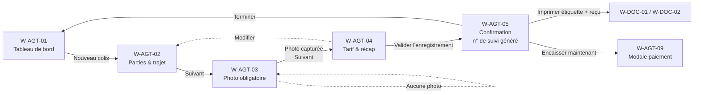
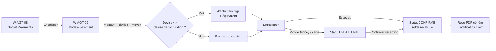
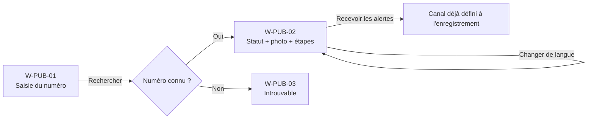

# 04 — Wireframes (interfaces agent, administration, client)

Version 1.0 — 2026-09-03
Complète [`01-specifications-techniques.md`](01-specifications-techniques.md),
[`02-architecture.md`](02-architecture.md) et le
[registre des décisions](00-registre-decisions.md).

Ces wireframes sont **basse fidélité** : ils fixent la structure, les champs, les états et
les règles d'interaction écran par écran. Ils ne fixent ni la charte graphique fine ni les
espacements exacts (portés par le design system, cf. §2). Chaque écran porte un identifiant
`W-xxx-nn` référencé par le livrable 5 (application) et le livrable 6 (manuels).

---

## Table des matières

1. [Inventaire des écrans](#1-inventaire-des-ecrans)
2. [Conventions UI et design system](#2-conventions-ui-et-design-system)
3. [Parcours principaux (flux)](#3-parcours-principaux-flux)
4. [Interface Agent fret](#4-interface-agent-fret)
5. [Interface Administration / DAF](#5-interface-administration--daf)
6. [Interface Super-administrateur / Configuration](#6-interface-super-administrateur--configuration)
7. [Interface Client (page publique de suivi)](#7-interface-client-page-publique-de-suivi)
8. [Documents imprimables](#8-documents-imprimables)
9. [Matrice écrans ↔ exigences](#9-matrice-ecrans--exigences)
10. [Comportement responsive et hors-ligne](#10-comportement-responsive-et-hors-ligne)

---

## 1. Inventaire des écrans

| ID | Écran | Rôle | Priorité |
|----|-------|------|----------|
| W-AUTH-01 | Connexion | Tous internes | MVP |
| W-AUTH-02 | Vérification MFA (OTP) | Tous internes | MVP |
| W-AUTH-03 | Mot de passe oublié / réinitialisation | Tous internes | MVP |
| W-AGT-01 | Tableau de bord agence | Agent | MVP |
| W-AGT-02 | Enregistrement colis — 1. Parties & trajet | Agent | MVP |
| W-AGT-03 | Enregistrement colis — 2. Photo du colis | Agent | MVP |
| W-AGT-04 | Enregistrement colis — 3. Tarif & récapitulatif | Agent | MVP |
| W-AGT-05 | Confirmation & impression étiquette/reçu | Agent | MVP |
| W-AGT-06 | Liste des colis (filtres) | Agent | MVP |
| W-AGT-07 | Fiche colis — onglet Suivi | Agent | MVP |
| W-AGT-08 | Fiche colis — onglet Paiements | Agent | MVP |
| W-AGT-09 | Modale « Encaisser un paiement » | Agent | MVP |
| W-AGT-10 | Fiche colis — onglet Photos | Agent | MVP |
| W-AGT-11 | Fiche colis — onglet Documents | Agent | MVP |
| W-AGT-12 | Modale « Changer le statut » | Agent | MVP |
| W-AGT-13 | Recherche rapide (barre globale) | Agent + Admin | MVP |
| W-ADM-01 | Tableau de bord consolidé multi-pays | DAF, Super-admin | MVP |
| W-ADM-02 | Rapports & exports | DAF, Super-admin | MVP |
| W-ADM-03 | Colis impayés / en retard | DAF, Super-admin | MVP |
| W-ADM-04 | Tarifs — prix par kg par destination | DAF, Super-admin | MVP |
| W-ADM-05 | Taux de change (sync + saisie manuelle) | DAF, Super-admin | MVP |
| W-ADM-06 | Journal d'audit | DAF, Super-admin | MVP |
| W-SAD-01 | Utilisateurs & rôles | Super-admin | MVP |
| W-SAD-02 | Détail utilisateur & périmètres | Super-admin | MVP |
| W-SAD-03 | Configuration — Identité visuelle & pied de page | Super-admin | MVP |
| W-SAD-04 | Configuration — Villes / Pays / Devises / Corridors | Super-admin | MVP |
| W-SAD-05 | Configuration — Textes du site public (fr/en/zh) | Super-admin | MVP |
| W-SAD-06 | Configuration — Modèles de notification | Super-admin | MVP |
| W-PUB-01 | Accueil public / saisie du numéro de suivi | Client | MVP |
| W-PUB-02 | Résultat du suivi | Client | MVP |
| W-PUB-03 | Numéro introuvable / erreur | Client | MVP |
| W-DOC-01 | Étiquette colis 100 × 150 mm | (impression) | MVP |
| W-DOC-02 | Reçu d'enregistrement / de paiement | (impression) | MVP |

---

## 2. Conventions UI et design system

### Grille et points de rupture

| Cible | Largeur | Grille | Usage |
|-------|---------|--------|-------|
| Mobile | 360–767 px | 4 colonnes, marge 16 px | Agent en mobilité, client |
| Tablette | 768–1023 px | 8 colonnes | Agent en agence (cible principale) |
| Bureau | ≥ 1024 px | 12 colonnes, contenu max 1280 px | Admin / DAF / super-admin |

### Ossature commune du back-office

```
+----------------------------------------------------------------------------+
| [Logo Okapi]  Okapi Logistics        [ Rechercher n° de suivi...  (/)  ]   |
|                                        Agence: Cotonou v | FR v | (AB) v   |
+------------+-------------------------------------------------------------+
| NAVIGATION |  FIL D'ARIANE  >  Titre de l'écran                         |
|            |                                                            |
| [#] Tableau|  ZONE DE CONTENU                                           |
| [+] Nouveau|                                                            |
| [=] Colis  |                                                            |
| [$] Encaiss|                                                            |
| ---------- |                                                            |
| ADMIN      |                                                            |
| [~] Rapport|                                                            |
| [%] Tarifs |                                                            |
| [x] Taux   |                                                            |
| [!] Audit  |                                                            |
| ---------- |                                                            |
| CONFIG     |                                                            |
| [o] Users  |                                                            |
| [*] Réglage|                                                            |
+------------+-------------------------------------------------------------+
```

- La navigation n'affiche que les entrées permises par le rôle et le périmètre du compte.
- Le sélecteur d'agence n'apparaît que si le compte couvre plusieurs agences.
- Sélecteur de langue **fr / en / zh** présent sur tous les écrans (D14).

### Jeton de couleurs (pilotés par la configuration, W-SAD-03)

| Rôle du jeton | Valeur par défaut | Usage |
|--------------|-------------------|-------|
| `--brand-navy` | `#170655` | En-têtes, navigation, boutons primaires |
| `--brand-orange` | `#E47911` | Action principale, accent, mise en avant |
| `--brand-turquoise` | `#1CA9C9` *(à confirmer)* | Liens, informations, graphes |
| `--brand-anthracite` | `#2E3138` *(à confirmer)* | Texte principal |
| `--ok` / `--warn` / `--err` | vert / ambre / rouge | Statuts (payé / partiel / impayé, succès / alerte / erreur) |

### Composants transverses

- **Badge statut colis** : `Enregistré` (gris) · `En transit` (turquoise) · `Arrivé` (navy) · `Livré` (vert) · `Annulé` (rouge contour) · `Retourné` (ambre).
- **Badge paiement** : `Payé` (vert) · `Partiel` (ambre + « solde X ») · `Impayé` (rouge).
- **Champ montant** : `[ 0,00 ] [DEVISE v]` — la devise par défaut = devise de facturation de l'agence ; l'équivalent en devise de référence (USD) est affiché en gris dessous.
- **Sélecteur ville** : autocomplétion sur le référentiel actif ; affiche `Ville (CODE)`.
- **États systématiques par écran** : chargement (squelette), vide (message + action), erreur (message + « réessayer »), hors-ligne (bandeau + file locale — v1.1).

### Accessibilité (rappel ENF-A11Y-01)

Navigation clavier complète, focus visible, contrastes AA, libellés explicites, messages
d'erreur reliés aux champs, raccourci `/` pour la recherche, `Échap` ferme les modales.

---

## 3. Parcours principaux (flux)

### 3.1 Enregistrement d'un colis (agent)



### 3.2 Encaissement d'un paiement (agent)



### 3.3 Suivi par le client (public)



---

## 4. Interface Agent fret

### W-AUTH-01 — Connexion

```
+---------------------------- Okapi Logistics -----------------------------+
|                                                                         |
|                     [ Logo Okapi ]                                      |
|                     Connexion à l'espace agence                         |
|                                                                         |
|   E-mail            [ prenom.nom@okapi.example            ]             |
|   Mot de passe      [ ..........................      (o) ]             |
|                                                                         |
|   [ ] Se souvenir de cet appareil                                       |
|                                                                         |
|                     [        Se connecter        ]                      |
|                                                                         |
|   Mot de passe oublié ?                                Langue: FR EN 中  |
+-------------------------------------------------------------------------+
| contact.gokapi@gmail.com  ·  « Le futur du commerce africain »          |
+-------------------------------------------------------------------------+
```

- Erreurs : identifiants invalides (message générique, pas d'indice sur le champ fautif),
  compte verrouillé (`locked_until`), compte désactivé.
- Après 5 échecs : verrouillage progressif + `audit_logs (LOGIN_FAILED)`.
- Succès → si `totp_enabled` : W-AUTH-02 ; sinon tableau de bord du rôle.

### W-AUTH-02 — Vérification MFA (OTP)

```
+-------------------------------------------------------------------------+
|   Vérification en deux étapes                                          |
|                                                                       |
|   Saisissez le code à 6 chiffres de votre application d'authentif.    |
|                                                                       |
|            [ _ ][ _ ][ _ ]  [ _ ][ _ ][ _ ]                           |
|                                                                       |
|   [ ] Faire confiance à cet appareil 30 jours                         |
|                                                                       |
|            [   Vérifier   ]      Renvoyer / utiliser un code de secours|
+-------------------------------------------------------------------------+
```

- Obligatoire pour `ADMIN_DAF` et `SUPER_ADMIN` (ENF-SEC-02). Recommandé, activable par
  l'agent lui-même dans son profil.

### W-AUTH-03 — Mot de passe oublié

Saisie e-mail → message neutre « si un compte existe, un lien a été envoyé » → page de
définition d'un nouveau mot de passe (jeton à usage unique, ≤ 1 h), règles de complexité
affichées, invalidation des sessions existantes à la réinitialisation.

---

### W-AGT-01 — Tableau de bord agence

```
+-- Agence Cotonou -----------------------------------  [ + Nouveau colis ]--+
|                                                                           |
|  +----------------+ +----------------+ +----------------+ +--------------+  |
|  | Colis du jour  | | En transit     | | Arrivés à      | | Impayés      |  |
|  |      14        | |      37        | | retirer:  9    | |    5  ⚠      |  |
|  +----------------+ +----------------+ +----------------+ +--------------+  |
|                                                                           |
|  Encaissements du jour (Cotonou)                                          |
|   Espèces 120 000 XOF · Mobile Money 85 000 XOF · Total ~ 342 USD         |
|                                                                           |
|  Derniers colis enregistrés                              [ Voir tous > ]  |
|  +---------------------------------------------------------------------+   |
|  | N° suivi         Destination   Statut       Paiement   Enregistré   |   |
|  | OKP26090012COO?  Kinshasa(FIH) Enregistré   Impayé     il y a 4 min |   |
|  | OKP26090041FIH   Kinshasa      En transit   Partiel··  09:12        |   |
|  | OKP26090040FIH   Kinshasa      Enregistré   Payé       08:57        |   |
|  +---------------------------------------------------------------------+   |
|                                                                           |
|  À faire : 9 colis « Arrivé » non remis · 5 relances impayés à envoyer   |
+---------------------------------------------------------------------------+
```

- KPIs bornés à l'agence active. Clic sur un KPI → W-AGT-06 pré-filtré.
- « Nouveau colis » = action orange, toujours visible (raccourci `n`).

---

### W-AGT-02 — Enregistrement colis · Étape 1/3 : Parties & trajet

```
+-- Nouveau colis --------------------------------  Étape 1/3 : Parties & trajet --+
|  ( 1 ) Parties & trajet  ──  ( 2 ) Photo  ──  ( 3 ) Tarif & récap               |
|                                                                                 |
|  EXPÉDITEUR                              DESTINATAIRE                             |
|  Nom *        [ Awa D.            ]      Nom *        [ Jean K.            ]       |
|  Téléphone *  [ +229 ........     ]      Téléphone *  [ +243 ........     ]       |
|  E-mail       [                   ]      E-mail       [                   ]       |
|  Adresse      [ Cotonou, ...      ]      Adresse      [ Kinshasa, Gombe   ]       |
|                                                                                 |
|  TRAJET                                                                          |
|  Ville de départ *     [ Cotonou (COO)      v ]                                  |
|  Ville de destination *[ Kinshasa (FIH)     v ]   -> code n° de suivi : FIH      |
|  Mode de transport *   ( ) Aérien   ( ) Maritime                                 |
|                                                                                 |
|  COLIS                                                                           |
|  Poids (kg) *          [   12,40 ]                                               |
|  Nature du contenu *   [ Pièces détachées                     ]                  |
|  Valeur déclarée       [    300,00 ] [ USD v ]   (informatif, litige/assurance)  |
|                                                                                 |
|  CONSENTEMENT                                                                    |
|  [x] Le client accepte les mentions d'information (suivi, notifications). v1     |
|      Version affichée : v1-2026-01                    [ Lire les mentions ]      |
|                                                                                 |
|                              [ Annuler ]              [ Suivant : Photo > ]     |
+---------------------------------------------------------------------------------+
```

- Champs `*` obligatoires. `Suivant` désactivé tant que le formulaire est invalide et que
  le consentement (RG-14) n'est pas coché.
- Ville de destination → met à jour l'aperçu du **code IATA** qui entrera dans le n° de suivi.
- Téléphones : masque international, préfixe pré-rempli selon le pays de la ville.
- `Idempotency-Key` généré à l'entrée de l'étape 1 (RG-12) : un double envoi ne crée qu'un colis.

---

### W-AGT-03 — Enregistrement colis · Étape 2/3 : Photo du colis (obligatoire)

```
+-- Nouveau colis ---------------------------------------  Étape 2/3 : Photo --+
|  ( 1 ) Parties & trajet  ──  (•2•) Photo  ──  ( 3 ) Tarif & récap           |
|                                                                            |
|   +------------------------------------------------+   Photo OBLIGATOIRE    |
|   |                                                |   (preuve en cas de   |
|   |            [ flux caméra en direct ]           |    litige, EF-ENR-04) |
|   |                                                |                       |
|   |      cadre de visée .  .  .  .  .  .           |   Caméra: [ Arrière v]|
|   |                                                |                       |
|   +------------------------------------------------+                        |
|                    (   ◉  Prendre la photo   )                              |
|                                                                            |
|   Photos du colis (1)                                                       |
|   +---------+   la 1re photo = photo principale (affichée au client)        |
|   | vign. 1 |   [ Reprendre ]  [ Définir principale ]  [ Supprimer ]        |
|   | ✔ prim. |                                                               |
|   +---------+   [ + Ajouter une autre photo ]                               |
|                                                                            |
|   i  EXIF de géolocalisation retiré · horodatage serveur · SHA-256 calculé  |
|                                                                            |
|              [ < Précédent ]                 [ Suivant : Tarif > ]         |
+----------------------------------------------------------------------------+
```

- `Suivant` **désactivé** tant qu'aucune photo principale n'est présente (EF-ENR-04/RG-06).
- Compression client à ~1600 px / ~300 Ko avant upload direct (presigned) vers l'objet (ENF-PERF-05).
- Si permission caméra refusée : repli « importer une image » + message d'aide.
- Après `EN_TRANSIT`, cet écran passe en lecture seule (EF-ENR-06) ; badge « verrouillée ».

---

### W-AGT-04 — Enregistrement colis · Étape 3/3 : Tarif & récapitulatif

```
+-- Nouveau colis -------------------------------  Étape 3/3 : Tarif & récap --+
|  ( 1 ) Parties & trajet  ──  ( 2 ) Photo  ──  (•3•) Tarif & récap            |
|                                                                             |
|  TARIF (destination Kinshasa · Aérien)                                       |
|   Prix par kg (config)        1,10 USD /kg      [ défini par l'admin ]       |
|   Poids                       12,40 kg                                        |
|   Frais fixes                 0,00 USD                                        |
|   Sous-total                  13,64 USD                                       |
|   Ajustement agent            [  0,00 ] USD   (fourchette -15% .. +15%)       |
|   ------------------------------------------------------------------          |
|   MONTANT TOTAL DÛ            [   13,64 ] [ USD v ]                           |
|                              ≈ 13,64 USD (devise de référence)               |
|                                                                             |
|   ⚠ Un ajustement hors fourchette exige une justification (tracée).          |
|                                                                             |
|  RÉCAPITULATIF                                                               |
|   Awa D. (+229…)  ->  Jean K. (+243…)                                         |
|   Cotonou (COO) -> Kinshasa (FIH) · Aérien · 12,40 kg · Pièces détachées     |
|   Valeur déclarée 300,00 USD · Photo ✔ · Consentement ✔                       |
|   Canal de notification du client : ( ) SMS  (x) WhatsApp  ( ) E-mail        |
|   Langue du client : [ FR v ]                                                |
|                                                                             |
|        [ < Précédent ]      [ Enregistrer et générer le n° de suivi ]       |
+---------------------------------------------------------------------------- +
```

- Le prix/kg vient de la config (W-ADM-04) pour la destination + mode ; s'il est absent,
  bandeau bloquant « Tarif non défini pour cette destination — contactez l'administration »
  (O-3).
- Devise de facturation = devise de l'agence, changeable ici parmi les devises actives
  (RG-02) ; figée dès le 1er paiement.
- Conversion vers USD affichée en permanence (EF-DEV-06). Si aucun taux : blocage + lien
  « saisir un taux » (rôles habilités) — sinon message à l'agent de prévenir l'admin.
- `Enregistrer` : appel unique idempotent → n° de suivi, montant dû, `payment_status = IMPAYE`.

---

### W-AGT-05 — Confirmation & impression

```
+-- Colis enregistré ✔ ------------------------------------------------------+
|                                                                          |
|   N° DE SUIVI :   OKP 2609 0043 FIH                                       |
|                   +--------------------------------------------+          |
|                   |  [ QR ]     OKP26090043FIH                 |          |
|                   |  |||||||||  Cotonou -> Kinshasa (FIH)      |          |
|                   |  Code128    12,40 kg · Aérien · 03/09/2026 |          |
|                   +--------------------------------------------+          |
|                                                                          |
|   Montant dû : 13,64 USD   ·   Statut paiement : IMPAYÉ                    |
|                                                                          |
|   [ 🖨 Imprimer l'étiquette ]   [ 🖨 Imprimer le reçu ]                     |
|   [ $ Encaisser maintenant ]   [ + Enregistrer un autre colis ]           |
|   [ Ouvrir la fiche colis ]                                               |
|                                                                          |
|   i  Étiquette et reçu archivés dans l'onglet Documents de la fiche.       |
+--------------------------------------------------------------------------+
```

- Impression : ouverture de l'aperçu PDF (W-DOC-01 / W-DOC-02) puis dialogue d'impression
  navigateur ; format étiquette 100 × 150 mm.
- « Encaisser maintenant » → W-AGT-09 pré-rempli avec le montant dû.

---

### W-AGT-06 — Liste des colis (filtres)

```
+-- Colis --------------------------------------------------  [ + Nouveau ]--+
|  Recherche [ n°, nom, téléphone...        ]                                |
|  Filtres : Statut [Tous v]  Paiement [Tous v]  Destination [Toutes v]      |
|            Mode [Tous v]  Période [30 j v]  Agent [Tous v]   [ Filtrer ]   |
|                                                            [ Exporter ▾ ]  |
|  +----------------------------------------------------------------------+   |
|  | N° suivi        Départ→Dest.   Poids  Statut      Paiement   Créé    |   |
|  |----------------------------------------------------------------------|   |
|  | OKP26090043FIH  COO → FIH      12,4   Enregistré  Impayé     11:20   |   |
|  | OKP26090041FIH  COO → FIH       5,0   En transit  Partiel 8$ 09:12   |   |
|  | OKP26090012BZV  COO → BZV       2,1   Arrivé      Payé      hier     |   |
|  | OKP26085501FIH  COO → FIH      18,0   Livré       Payé      02/09    |   |
|  +----------------------------------------------------------------------+   |
|  1–25 sur 312           [ < ]  1 2 3 ... 13  [ > ]     Lignes [25 v]       |
+--------------------------------------------------------------------------- +
```

- Colonnes triables. Ligne cliquable → W-AGT-07.
- Périmètre : un agent ne voit que son agence ; un DAF voit ses pays.
- `Exporter` : Excel / PDF de la sélection filtrée (asynchrone si volumineux).

---

### W-AGT-07 — Fiche colis · onglet Suivi

```
+-- OKP26090041FIH -------------------------------------------------------- +
|  Cotonou (COO) → Kinshasa (FIH) · Aérien · 5,0 kg                         |
|  [ Statut: EN TRANSIT ]   [ Paiement: PARTIEL — solde 5,00 USD ]          |
|                                                                          |
|  [ Suivi ] [ Paiements ] [ Photos ] [ Documents ]        [ Changer statut ]|
|  ----------------------------------------------------------------------    |
|  HISTORIQUE DES ÉTAPES                        [ + Ajouter un évènement ]   |
|                                                                          |
|   ●  Enregistré        Cotonou      03/09/2026 09:12   par A. Boni        |
|   ●  En transit        Cotonou      03/09/2026 14:40   par A. Boni        |
|   ○  Arrivé            —            —                                     |
|   ○  Livré             —            —                                     |
|                                                                          |
|   Note interne (visible client [x]) : « Départ vol OK-　»                  |
|                                                                          |
|  EXPÉDITEUR   Awa D. · +229 …            DESTINATAIRE  Jean K. · +243 …    |
|  Valeur déclarée 300,00 USD · Contenu : Pièces détachées                  |
|  Canal client : WhatsApp · Langue : FR                                    |
+--------------------------------------------------------------------------+
```

- `Changer statut` → W-AGT-12 (transitions autorisées seulement, RG-07).
- Les évènements `visible client` alimentent W-PUB-02 ; les autres restent internes.
- Le bloc parties est masqué/anonymisé si le dossier a été anonymisé (RGPD).

---

### W-AGT-08 — Fiche colis · onglet Paiements

```
+-- OKP26090041FIH · Paiements ------------------------------------------- +
|  Montant dû      13,64 USD                                               |
|  Déjà encaissé    8,64 USD                                               |
|  SOLDE RESTANT    5,00 USD               [ $ Encaisser un paiement ]      |
|                                                                         |
|  HISTORIQUE DES PAIEMENTS                                                |
|  +------------------------------------------------------------------+    |
|  | Date        Montant      Moyen           Réf.        Agent  État |    |
|  |------------------------------------------------------------------|    |
|  | 03/09 09:20 5 000 XOF    Mobile Money    MP12345     A.Boni  ✔  |    |
|  |             ≈ 8,20 USD (taux 0,001640)   (M-Pesa)               |    |
|  | 03/09 09:25 0,44 USD     Espèces         —           A.Boni  ✔  |    |
|  | 03/09 10:01 3,00 USD     Carte           TPE-0098    A.Boni  ⏳ |    |
|  +------------------------------------------------------------------+    |
|  ⏳ En attente de confirmation : [ Confirmer ] [ Marquer échec ]         |
|                                                                         |
|  Reçus générés : Reçu #BJ-2026-000512, #BJ-2026-000513  (onglet Docs)    |
|  [ Demander un remboursement ]  (réservé DAF / super-admin)              |
+-------------------------------------------------------------------------+
```

- Chaque ligne montre la devise saisie **et** l'équivalent en devise de facturation + le
  taux figé (EF-PAY-05). Les paiements `⏳ EN_ATTENTE` ne comptent pas dans le solde.
- Remboursement : bouton visible pour tous mais action réservée DAF/super-admin ; sinon
  « demande » tracée.

---

### W-AGT-09 — Modale « Encaisser un paiement »

```
+===================== Encaisser un paiement =======================+
|  Colis OKP26090041FIH · Solde restant : 5,00 USD                  |
|                                                                  |
|  Montant reçu *     [   5 000     ] [ XOF v ]                     |
|                     ≈ 8,20 USD  ·  taux XOF→USD 0,001640          |
|                     (taux du 03/09/2026, source exchangerate.host)|
|                                                                  |
|  Moyen de paiement * ( ) Espèces                                  |
|                      (x) Mobile Money  →  [ M-Pesa v ]           |
|                      ( ) Carte bancaire                           |
|                      ( ) Virement bancaire                        |
|  Référence de transaction  [ MP-2026-000123        ]  (recommandé)|
|  Date d'encaissement       [ 03/09/2026 09:20 ]                   |
|  Note                      [                       ]              |
|                                                                  |
|  Après enregistrement :                                           |
|   • Espèces → confirmé immédiatement                              |
|   • Mobile Money / carte / virement → « en attente » puis à       |
|     confirmer à réception effective des fonds                     |
|                                                                  |
|            [ Annuler ]              [ Enregistrer le paiement ]   |
+==================================================================+
```

- Devise par défaut = devise de facturation ; si l'agent change de devise, le bloc taux
  apparaît (taux figé au moment de l'enregistrement, EF-PAY-05).
- `Idempotency-Key` sur l'enregistrement (RG-12).
- Montant > solde : autorisé (avance / trop-perçu) avec confirmation ; statut passe à `Payé`.
- À la confirmation : reçu PDF (EF-PAY-07) + notification « paiement reçu » au client.

---

### W-AGT-10 — Fiche colis · onglet Photos

```
+-- OKP26090041FIH · Photos -------------------------------------------- +
|  +---------+  +---------+  +---------+          [ + Ajouter une photo ] |
|  | photo 1 |  | photo 2 |  | photo 3 |          (bloqué si EN TRANSIT+) |
|  | ★ princ.|  |         |  |         |                                  |
|  +---------+  +---------+  +---------+                                  |
|                                                                      |
|  Photo 1 — prise le 03/09/2026 09:12 par A. Boni                      |
|  SHA-256 3f9a… · 1600×1200 · 287 Ko · EXIF géo retiré ✔ · verrouillée  |
|  [ Voir en grand ]  [ Définir comme principale ]  [ Supprimer ]        |
|                                                                      |
|  i  La photo principale est celle affichée au client sur la page de    |
|     suivi (via URL signée temporaire). Aucune suppression après        |
|     expédition, sauf demande RGPD tracée (super-admin).                |
+--------------------------------------------------------------------- +
```

### W-AGT-11 — Fiche colis · onglet Documents

```
+-- OKP26090041FIH · Documents ---------------------------------------- +
|  Type                    Numéro           Généré le        Action     |
|  Étiquette               —                03/09 09:12      [Télécharger]|
|  Reçu d'enregistrement   BJ-2026-000511   03/09 09:12      [Télécharger]|
|  Reçu de paiement        BJ-2026-000512   03/09 09:20      [Télécharger]|
|  Reçu de paiement        BJ-2026-000513   03/09 09:25      [Télécharger]|
|  Facture (à la clôture)  —                —                (indispo.)  |
|                                                                      |
|  i  Liens de téléchargement = URL signées expirant sous 15 min.        |
+--------------------------------------------------------------------- +
```

### W-AGT-12 — Modale « Changer le statut »

```
+================= Changer le statut du colis ==================+
|  Colis OKP26090041FIH · Statut actuel : EN TRANSIT           |
|                                                             |
|  Nouveau statut *   ( ) Arrivé     ( ) Retourné             |
|                     (transitions autorisées uniquement)     |
|  Lieu / ville       [ Kinshasa (FIH)  v ]                   |
|  Date / heure       [ 04/09/2026 07:30 ]                    |
|  Commentaire        [                                  ]    |
|  [x] Visible par le client                                  |
|                                                             |
|  ⚠ Passage à « Livré » avec solde impayé :                   |
|     autorisé seulement avec justification d'un responsable   |
|     (politique du pays : FR = strict, autres = dérogation).  |
|                                                             |
|            [ Annuler ]        [ Confirmer le changement ]   |
+=============================================================+
```

- Le sélecteur ne propose que les statuts atteignables depuis l'état courant (RG-07).
- `Arrivé` + `payment_status ∈ {PARTIEL, IMPAYE}` déclenche la relance client (EF-PAY-10).
- `Livré` + solde > 0 : champ justification obligatoire, action tracée (RG-08).

### W-AGT-13 — Recherche rapide (barre globale)

Raccourci `/`. Recherche par n° de suivi (exact ou partiel), nom/téléphone d'une partie.
Résultats groupés (Colis / Contacts). Entrée → fiche colis. Périmètre appliqué.

---

## 5. Interface Administration / DAF

### W-ADM-01 — Tableau de bord consolidé multi-pays

```
+-- Direction · Tableau de bord ------------------------------------------- +
|  Périmètre [ Tous pays v ]  Pays [ Tous v ]  Agence [ Toutes v ]         |
|  Période [ 01/08 → 03/09 v ]  Devise d'affichage [ Réf. USD v ]  [Filtrer]|
|                                                                         |
|  +-------------+ +-------------+ +--------------+ +--------------------+   |
|  | Colis       | | CA (réf.)   | | Taux impayés | | Délai moyen /     |   |
|  |  4 812      | | 61 240 USD  | |   7,3 %      | | corridor: 5,4 j   |   |
|  +-------------+ +-------------+ +--------------+ +--------------------+   |
|                                                                         |
|  CA par devise d'origine                    Colis par statut             |
|  XOF ▓▓▓▓▓▓▓▓ 18,2M     ≈ 30 100 USD        Enregistré  812             |
|  CDF ▓▓▓▓▓ 41,0M        ≈ 14 500 USD        En transit  2 640           |
|  USD ▓▓▓ 9 800          9 800 USD           Arrivé      690             |
|  ZAR ▓▓ 78 000          ≈ 4 100 USD         Livré       640             |
|  ...                                        Annulé/Ret. 30              |
|                                                                         |
|  Top destinations : FIH 61% · BZV 14% · JNB 9% · DAR 7% · KGL 5%         |
|  Encaissements par moyen : Mobile Money 58% · Espèces 30% · Carte 8% ... |
|                                                                         |
|  [ Voir les impayés (W-ADM-03) ]   [ Rapports & exports (W-ADM-02) ]     |
+---------------------------------------------------------------------------+
```

- Tous les agrégats respectent le périmètre du compte (un DAF pays ne voit que ses pays).
- Bascule « devise d'affichage » : ventilation par devise d'origine ↔ tout consolidé en USD
  (EF-DEV-07).
- Données servies par vues d'agrégat / vue matérialisée (perf < 5 s, ENF-PERF-03).

### W-ADM-02 — Rapports & exports

```
+-- Rapports & exports ------------------------------------------------- +
|  Rapport [ Volumes traités v ]                                        |
|   Autres : CA par devise · Colis impayés/en retard · Journal des      |
|            paiements · Export comptable · Journal d'audit             |
|                                                                      |
|  Filtres  Pays [ v ]  Agence [ v ]  Période [ v ]  Statut [ v ]       |
|           Devise [ v ]  Mode [ v ]                                    |
|                                                                      |
|  Aperçu (100 premières lignes)                                        |
|  +--------------------------------------------------------------+     |
|  | Pays  Agence   Colis  Poids   CA (orig.)  CA (USD)  Impayés  |     |
|  | BJ    Cotonou   1 204  9,8 t   18,2M XOF   30 100    82      |     |
|  | CD    Kinshasa  2 015  ...     41,0M CDF   14 500    140     |     |
|  +--------------------------------------------------------------+     |
|                                                                      |
|  Format d'export : (x) Excel (.xlsx)  ( ) PDF  ( ) CSV (comptable)    |
|                      [ Générer l'export ]                            |
|                                                                      |
|  Exports récents                                                     |
|   volumes_2026-08.xlsx   prêt      [ Télécharger ]                   |
|   ca_devise_2026-08.pdf  en cours… (généré en arrière-plan)          |
+-------------------------------------------------------------------- +
```

- Exports volumineux = tâche asynchrone, lien de téléchargement signé quand prêt (EF-ADM-04/05).
- L'export comptable CSV inclut : date, pièce, colis, devise d'origine, montant, contre-valeur
  USD, taux (EF-ADM-05).

### W-ADM-03 — Colis impayés / en retard

```
+-- Impayés & retards ------------------------------------------------- +
|  Filtres : Statut [ Arrivé v ]  Paiement [ Impayé + Partiel v ]       |
|            Pays [ v ]  Ancienneté [ > 2 j v ]        [ Filtrer ]      |
|                                                                      |
|  +--------------------------------------------------------------+     |
|  | N° suivi        Dest.  Arrivé le  Solde        Relances  Sel.|     |
|  | OKP26088812FIH  FIH    31/08      5,00 USD     2 (SMS)   [x] |     |
|  | OKP26088790FIH  FIH    30/08      12,00 USD    1 (WA)    [x] |     |
|  | OKP26088401BZV  BZV    29/08      3 000 XOF    0         [ ] |     |
|  +--------------------------------------------------------------+     |
|                                                                      |
|  [ Envoyer une relance aux colis sélectionnés ]  Canal [ Auto v ]    |
|  i  « Auto » = canal préféré défini à l'enregistrement de chaque colis.|
+-------------------------------------------------------------------- +
```

### W-ADM-04 — Tarifs : prix par kg par destination

```
+-- Tarifs · Prix par kg par destination ----------------  [ + Ajouter ]--+
|  Filtre : Corridor [ Tous v ]  Mode [ Tous v ]  Devise [ Toutes v ]     |
|                                                                        |
|  +-----------------------------------------------------------------+    |
|  | Destination      Mode     Prix/kg    Frais fixes  Min    Valide |    |
|  |-----------------------------------------------------------------|    |
|  | Kinshasa (FIH)   Aérien   1,10 USD   0,00         0,00   depuis |    |
|  |                                                          01/07  |    |
|  | Kinshasa (FIH)   Maritime 0,45 USD   0,00         5,00   depuis |    |
|  | Brazzaville(BZV) Aérien   1,05 USD   0,00         0,00   01/06  |    |
|  | Johannesbg (JNB) Aérien   1,60 USD   10,00        0,00   01/08  |    |
|  +-----------------------------------------------------------------+    |
|                                                        [ Modifier ]    |
|                                                                        |
|  ── Édition ────────────────────────────────────────────────────       |
|  Destination *  [ Kinshasa (FIH)  v ]   Mode * ( ) Aérien (x) Maritime |
|  Devise *       [ USD v ]                                              |
|  Prix par kg *  [   0,45 ]   Frais fixes [ 0,00 ]   Minimum [ 5,00 ]   |
|  Ad valorem     [ ] activer   Taux [ 0,00 % ] de la valeur déclarée    |
|  Fourchette d'ajustement agent : [ -15 % ] .. [ +15 % ]               |
|  Valide à partir du [ 04/09/2026 ]                                    |
|                       [ Annuler ]      [ Enregistrer le tarif ]       |
+--------------------------------------------------------------------- +
```

- Champ **prix par kg par destination** = cœur de la tarification v1 (D6). `Frais fixes`,
  `Min`, `Ad valorem` optionnels (0 par défaut).
- Un nouveau tarif crée une nouvelle version datée ; l'historique est conservé ; pas de
  chevauchement de périodes pour une même cible + mode (contrainte BDD).
- Toute modification est tracée (`audit_logs`, `CONFIG_CHANGE`).

### W-ADM-05 — Taux de change

```
+-- Taux de change ------------------------------------------------------ +
|  Devise de référence : USD          Dernière synchro : 03/09 06:00 ✔    |
|  Source auto : exchangerate.host    Fréquence : toutes les 6 h          |
|  [ Synchroniser maintenant ]   ⚠ Alerte si un taux dépasse 36 h        |
|                                                                        |
|  Taux courants (1 unité → USD)                                          |
|  +------------------------------------------------------------------+   |
|  | Devise  Taux → USD    Source     Depuis            Âge           |   |
|  | XOF     0,001640      API        03/09 06:00       3 h    ✔      |   |
|  | CDF     0,000355      MANUEL     02/09 17:10       17 h   ✔      |   |
|  | EUR     1,0850        API        03/09 06:00       3 h    ✔      |   |
|  | ZAR     0,0540        API        01/09 06:00       50 h   ⚠      |   |
|  +------------------------------------------------------------------+   |
|                                                                        |
|  ── Saisir un taux manuellement ──────────────────────────────         |
|   Devise [ CDF v ]  →  USD   Taux [ 0,000356 ]                         |
|   Effectif à partir de [ 03/09/2026 12:00 ]   Note [ décision DAF ]    |
|                        [ Enregistrer le taux manuel ]                  |
|                                                                        |
|  i  Un taux manuel plus récent prévaut sur la synchro. L'historique     |
|     complet est conservé (aucun taux passé n'est écrasé).              |
+-------------------------------------------------------------------- +
```

- Historique par couple : lien « voir l'historique » → liste chronologique (append-only).
- Badge ⚠ sur un taux périmé ; les transactions restent possibles avec le dernier taux,
  mais l'alerte remonte au tableau de bord.

### W-ADM-06 — Journal d'audit

```
+-- Journal d'audit -------------------------------------------------- +
|  Filtres : Acteur [ v ]  Action [ Toutes v ]  Entité [ v ]           |
|            Période [ 7 j v ]                     [ Filtrer ] [Export] |
|  +--------------------------------------------------------------+     |
|  | Horodatage       Acteur      Action        Entité      IP    |     |
|  | 03/09 10:01:22   A. Boni     REFUND(demande) payment/…  …    |     |
|  | 03/09 09:25:04   A. Boni     CREATE         payment/…   …    |     |
|  | 03/09 08:40:11   DAF Zone 1  CONFIG_CHANGE  tariff/…    …    |     |
|  |   ▸ avant : { price_per_kg: 1.00 }  après : { 1.10 }          |     |
|  | 03/09 07:12:00   système     TRANSITION     parcel/…    —    |     |
|  +--------------------------------------------------------------+     |
|  Lecture seule · conservation ≥ 5 ans · export CSV/PDF (DAF/SA)       |
+------------------------------------------------------------------- +
```

---

## 6. Interface Super-administrateur / Configuration

### W-SAD-01 — Utilisateurs & rôles

```
+-- Utilisateurs ------------------------------------------  [ + Inviter ]--+
|  Recherche [ nom, e-mail... ]   Rôle [ Tous v ]  Pays [ v ]  Actif [x]   |
|  +------------------------------------------------------------------+     |
|  | Nom            E-mail              Rôles           Périmètre  MFA|     |
|  | A. Boni        a.boni@okapi…       Agent fret      Cotonou    ✔ |     |
|  | M. Kalala      m.kalala@okapi…     Agent fret      Kinshasa   – |     |
|  | Zone 1 DAF     daf1@okapi…         Admin/DAF       BJ, CG     ✔ |     |
|  | S. Admin       admin@okapi…        Super-admin     Global     ✔ |     |
|  +------------------------------------------------------------------+     |
|  [ Désactiver ]  [ Réinitialiser MFA ]  [ Renvoyer l'invitation ]        |
+---------------------------------------------------------------------------+
```

### W-SAD-02 — Détail utilisateur & périmètres

```
+-- Utilisateur · M. Kalala ------------------------------------------- +
|  Identité   Nom [ M. Kalala ]  E-mail [ m.kalala@okapi… ]            |
|             Téléphone [ +243 … ]  Langue interface [ FR v ]         |
|  Statut     (x) Actif   ( ) Désactivé                               |
|  Sécurité   MFA : non activé   [ Exiger l'activation à la connexion ]|
|             [ Réinitialiser le mot de passe ]  [ Révoquer sessions ] |
|                                                                    |
|  RÔLES & PÉRIMÈTRES                              [ + Ajouter un rôle ]|
|  +--------------------------------------------------------------+    |
|  | Rôle          Périmètre pays     Périmètre agence            |    |
|  | Agent fret    CD                 Kinshasa            [ x ]   |    |
|  +--------------------------------------------------------------+    |
|  i  Un agent doit avoir au moins une agence. Un DAF peut couvrir     |
|     plusieurs pays. Super-admin = global (pas de périmètre).         |
|                                                                    |
|                         [ Annuler ]     [ Enregistrer ]            |
+------------------------------------------------------------------- +
```

### W-SAD-03 — Configuration : identité visuelle & pied de page

```
+-- Configuration · Identité visuelle -------------------------------- +
|  Logo            [ apercu ]   [ Téléverser un nouveau logo (SVG/PNG) ]|
|  Couleur marine  [ #170655 ] ▉      Orange     [ #E47911 ] ▉         |
|  Turquoise       [ #1CA9C9 ] ▉      Anthracite [ #2E3138 ] ▉         |
|                                                                    |
|  PIED DE PAGE (site public + pièces)                                |
|  E-mail de contact   [ contact.gokapi@gmail.com ]                   |
|  Téléphone           [ +229 …          ]                            |
|  Site web            [ https://…       ]                            |
|  Réseaux sociaux     Facebook [ https://… ]  Instagram [ https://… ]|
|                      LinkedIn [ https://… ]  X [ https://… ]         |
|  Slogan  FR [ Le futur du commerce africain ]                       |
|          EN [ The future of African trade   ]                       |
|          中 [ 非洲贸易的未来                  ]                        |
|                                                                    |
|  [ Prévisualiser ]        [ Enregistrer (versionné + tracé) ]       |
+------------------------------------------------------------------- +
```

- Modifications sans redéploiement (EF-CFG-01) ; versionnées avec prévisualisation
  (EF-CFG-04) ; restauration des valeurs par défaut possible (EF-CFG-05).

### W-SAD-04 — Configuration : Villes / Pays / Devises / Corridors

```
+-- Configuration · Référentiel ------------------------------------- +
|  [ Villes ] [ Pays ] [ Devises ] [ Corridors ]                     |
|  ---------------------------------------------------------------    |
|  DEVISES                                        [ + Ajouter ]      |
|  +----------------------------------------------------------+      |
|  | Code  Symbole  Décimales  Réf.   Active                  |      |
|  | USD   $        2          (o)    [x]                     |      |
|  | XOF   FCFA     0          ( )    [x]                     |      |
|  | CDF   FC       2          ( )    [x]                     |      |
|  | ZAR   R        2          ( )    [x]                     |      |
|  | CNY   ¥        2          ( )    [ ]  (ouverture Chine)  |      |
|  +----------------------------------------------------------+      |
|  i  Ajouter une devise = 1 ligne + activation. Aucune n'est        |
|     codée en dur. Une seule devise de référence (USD).            |
|                                                                  |
|  VILLES (onglet)  : code IATA, pays, fuseau, origine/destination  |
|  PAYS  (onglet)   : ISO2, devise par défaut, langue, préfixe tel, |
|                     TVA (0 par défaut), politique impayé          |
|  CORRIDORS(onglet): pays origine → pays destination, actif        |
+---------------------------------------------------------------- +
```

### W-SAD-05 — Configuration : textes du site public (multilingue)

```
+-- Configuration · Textes du site public --------------------------- +
|  Bloc [ public.home.title v ]         Langue [ FR | EN | 中 ]        |
|  ---------------------------------------------------------------     |
|  FR  [ Suivez votre colis Okapi en temps réel               ]      |
|  EN  [ Track your Okapi parcel in real time                 ]      |
|  中  [ 实时跟踪您的 Okapi 包裹                                  ]      |
|                                                                   |
|  Autres blocs : accueil (sous-titre), aide à la saisie, mentions   |
|  légales, politique de confidentialité, cookies, contact DPO,      |
|  bannière, FAQ.                                                    |
|                                                                   |
|  [ Prévisualiser la page publique ]   [ Publier ]                  |
|  i  Markdown autorisé pour les blocs longs (mentions, FAQ).        |
+---------------------------------------------------------------- +
```

### W-SAD-06 — Configuration : modèles de notification

```
+-- Configuration · Modèles de notification ------------------------- +
|  Déclencheur [ Changement de statut v ]  Canal [ WhatsApp v ]       |
|  Langue [ FR v ]                          Actif [x]                 |
|  ---------------------------------------------------------------     |
|  Objet (e-mail uniquement) [ — ]                                    |
|  Corps                                                             |
|  +-----------------------------------------------------------+      |
|  | Bonjour, votre colis {{numero_suivi}} est maintenant      |      |
|  | « {{statut}} » à {{ville_actuelle}}.                       |      |
|  | Suivi : {{lien_suivi}}                                     |      |
|  +-----------------------------------------------------------+      |
|  Variables : {{numero_suivi}} {{statut}} {{ville_destination}}      |
|              {{ville_actuelle}} {{lien_suivi}} {{solde}} {{devise}} |
|                                                                   |
|  [ Envoyer un test ]   [ Enregistrer ]                             |
|  i  Fournisseurs : WhatsApp = Meta Business API · E-mail = Amazon   |
|     SES · SMS = à venir (canal prévu, connecteur non finalisé).    |
+---------------------------------------------------------------- +
```

---

## 7. Interface Client (page publique de suivi)

### W-PUB-01 — Accueil / saisie du numéro

```
+---------------------------------------------------------------+
|  [Logo Okapi]                              FR | EN | 中        |
+---------------------------------------------------------------+
|                                                             |
|            Suivez votre colis Okapi en temps réel            |
|                                                             |
|     Numéro de suivi                                          |
|     [  OKP26090043FIH                         ]  [ Suivre ]  |
|     Exemple : OKP26090043FIH                                 |
|                                                             |
|     Aucun compte nécessaire.                                 |
|                                                             |
+---------------------------------------------------------------+
|  contact.gokapi@gmail.com   ·   Facebook  Instagram  LinkedIn |
|  « Le futur du commerce africain »   ·   Mentions · Confident.|
+---------------------------------------------------------------+
```

- Responsive, léger, utilisable en 3G (ENF-PERF-02). Détection de langue puis choix manuel.
- Rate limiting par IP ; CAPTCHA activé seulement si abus détecté (EF-SUI-05).
- Lien profond `…/fr/suivi/OKP26090043FIH` → va directement à W-PUB-02.

### W-PUB-02 — Résultat du suivi

```
+---------------------------------------------------------------+
|  [Logo]  Colis OKP26090043FIH                    FR | EN | 中 |
+---------------------------------------------------------------+
|                                                             |
|   Statut : ●  EN TRANSIT                                     |
|   Cotonou  ───●───────○────────○  Kinshasa                   |
|            Enreg.  Transit  Arrivé  Livré                    |
|                                                             |
|   Paiement : ⬤ Paiement partiel   (ou : Payé / En attente)   |
|              (aucun montant affiché)                         |
|                                                             |
|   +-----------------------------+                            |
|   |     [ photo du colis ]      |   Destination : Kinshasa   |
|   |                             |   Enregistré le 03/09/2026 |
|   +-----------------------------+                            |
|                                                             |
|   Historique                                                 |
|    03/09 14:40  En transit — Cotonou                         |
|    03/09 09:12  Enregistré — Cotonou                         |
|                                                             |
|   i Vous recevez déjà les mises à jour par WhatsApp.          |
+---------------------------------------------------------------+
|  contact.gokapi@gmail.com  ·  « Le futur du commerce africain »|
+---------------------------------------------------------------+
```

- N'affiche **jamais** : noms complets, adresses, téléphones, valeur déclarée, montants,
  moyens de paiement, références (EF-SUI-04). Statut paiement = libellé synthétique.
- Photo servie via URL signée temporaire (≤ 60 min), régénérée à chaque affichage (EF-SUI-03).
- Seuls les évènements `visible client` apparaissent dans l'historique.
- États : chargement, « colis annulé », « colis livré » (frise complète en vert).

### W-PUB-03 — Numéro introuvable / erreur

```
+---------------------------------------------------------------+
|  [Logo]                                          FR | EN | 中 |
+---------------------------------------------------------------+
|   Nous n'avons trouvé aucun colis avec ce numéro.            |
|                                                             |
|   • Vérifiez la saisie (format : OKP + 8 chiffres + 3 lettres)|
|   • Le colis vient peut-être d'être enregistré ; réessayez   |
|     dans quelques minutes.                                   |
|                                                             |
|   [ Réessayer ]        Besoin d'aide ? contact.gokapi@gmail.com|
+---------------------------------------------------------------+
```

- Message identique que le numéro soit mal formé ou simplement inconnu (anti-énumération).
- Rate limit : après N tentatives infructueuses depuis une IP, CAPTCHA.

---

## 8. Documents imprimables

### W-DOC-01 — Étiquette colis (100 × 150 mm)

```
+========================== 100 x 150 mm ==========================+
|  OKAPI LOGISTICS                                   Aérien        |
|  ------------------------------------------------------------    |
|                                                                |
|   +--------------+     OKP26090043FIH                           |
|   |     QR       |     |I| |II| |I| |III| |I|  (Code 128)        |
|   |   code       |                                              |
|   +--------------+                                              |
|                                                                |
|   DE  : Cotonou (COO)            LE : 03/09/2026                 |
|   À   : Kinshasa (FIH)           Poids : 12,40 kg               |
|                                                                |
|   Exp. : Awa D.            Dest. : Jean K.                      |
|          +229 ........            +243 ........                 |
|                                                                |
|   Suivi : suivi.okapilogistics — OKP26090043FIH                 |
+================================================================+
```

- QR = numéro de suivi (ouvre la page publique). Code-barres Code 128 = numéro de suivi.
- Généré en PDF, archivé (`documents`, type `LABEL`). Réimpression depuis W-AGT-11.

### W-DOC-02 — Reçu d'enregistrement / de paiement (A5)

```
+------------------------------------------------------------+
|  OKAPI LOGISTICS                 REÇU N° BJ-2026-000512    |
|  Agence Cotonou · +229 …         Date : 03/09/2026 09:20   |
|  contact.gokapi@gmail.com                                  |
|  --------------------------------------------------------  |
|  Colis        : OKP26090043FIH                             |
|  Trajet       : Cotonou (COO) -> Kinshasa (FIH) · Aérien   |
|  Poids        : 12,40 kg                                   |
|  --------------------------------------------------------  |
|  Montant total dû      : 13,64 USD                         |
|  Paiement reçu         : 5 000 XOF  (≈ 8,20 USD)           |
|     Moyen : Mobile Money (M-Pesa) · Réf : MP-2026-000123   |
|     Taux appliqué : 1 XOF = 0,001640 USD (03/09/2026)      |
|  Déjà encaissé (cumul) : 8,64 USD                          |
|  SOLDE RESTANT         : 5,00 USD                          |
|  --------------------------------------------------------  |
|  Statut de paiement : PARTIEL                              |
|  Encaissé par : A. Boni                                    |
|  Mentions légales : {{selon pays}} · TVA 0 %               |
|  « Le futur du commerce africain »                         |
+------------------------------------------------------------+
```

- Un reçu à chaque paiement (EF-PAY-07) ; une facture récapitulative à la clôture (`PAYE`).
- Numérotation continue par pays (RG-09). Mentions et taux figés (immuabilité).

---

## 9. Matrice écrans ↔ exigences

| Écran | Exigences couvertes (extrait) |
|-------|-------------------------------|
| W-AUTH-01/02/03 | ENF-SEC-01, ENF-SEC-02, ENF-SEC-03 |
| W-AGT-02 | EF-ENR-01, EF-ENR-02, EF-ENR-03, RG-14 |
| W-AGT-03 | EF-ENR-04, EF-ENR-05, EF-ENR-06, RG-06, ENF-PERF-05 |
| W-AGT-04 | EF-ENR-09, EF-DEV-05, EF-DEV-06, RG-02, RG-13 |
| W-AGT-05 | EF-ENR-07, EF-ENR-08, EF-ENR-10, RG-01 |
| W-AGT-07 | EF-ENR-11, EF-ENR-12, RG-07 |
| W-AGT-08 / W-AGT-09 | EF-PAY-01..07, EF-PAY-12, EF-DEV-05, RG-03, RG-12 |
| W-AGT-12 | EF-ENR-11, EF-PAY-10, EF-PAY-11, RG-07, RG-08 |
| W-ADM-01 | EF-ADM-01, EF-ADM-02, EF-ADM-03, EF-DEV-07 |
| W-ADM-02 | EF-ADM-04, EF-ADM-05 |
| W-ADM-03 | EF-PAY-10, EF-ADM-03 |
| W-ADM-04 | EF-ENR-09, EF-CFG-02 (tarifs), D6 |
| W-ADM-05 | EF-DEV-03, EF-DEV-04, EF-DEV-08 |
| W-ADM-06 | ENF-SEC-06 |
| W-SAD-01 / W-SAD-02 | EF-ADM-06, ENF-SEC-04 |
| W-SAD-03 | EF-CFG-01, EF-CFG-04, EF-CFG-05 |
| W-SAD-04 | EF-CFG-02, EF-DEV-01, EF-DEV-02, EF-EVOL-01 |
| W-SAD-05 | EF-CFG-03, ENF-I18N-01, ENF-I18N-05 |
| W-SAD-06 | EF-NOT-01, EF-NOT-03, EF-NOT-06 |
| W-PUB-01 | EF-SUI-01, EF-SUI-05, EF-SUI-07, EF-SUI-08 |
| W-PUB-02 | EF-SUI-02, EF-SUI-03, EF-SUI-04, EF-SUI-06 |
| W-PUB-03 | EF-SUI-05 |
| W-DOC-01 / W-DOC-02 | EF-ENR-10, EF-PAY-07, EF-PAY-08, RG-09 |

---

## 10. Comportement responsive et hors-ligne

### Responsive

| Écran | Mobile | Tablette | Bureau |
|-------|--------|----------|--------|
| Enregistrement colis (W-AGT-02..05) | Étapes en pleine largeur, 1 colonne ; capture photo plein écran, caméra arrière par défaut | Cible principale : 2 colonnes (expéditeur / destinataire) | 2 colonnes + panneau récapitulatif latéral persistant |
| Listes (W-AGT-06, W-ADM-*) | Cartes empilées (n°, statut, paiement, date) | Tableau condensé | Tableau complet + filtres en barre |
| Tableau de bord (W-ADM-01) | KPIs 1/ligne, graphes empilés | KPIs 2×2 | KPIs en ligne + graphes côte à côte |
| Page publique (W-PUB-*) | Design mobile-first, frise verticale | Frise horizontale | Contenu centré max 640 px |

### Hors-ligne (PWA — socle v1, complet v1.1, D11)

- **v1** : back-office installable (PWA), ressources statiques et référentiels mis en cache ;
  une perte de réseau pendant la saisie affiche un bandeau « hors ligne — vos actions seront
  bloquées » (pas de perte de données de formulaire).
- **v1.1** : file locale chiffrée (IndexedDB) — l'agent enregistre colis + photo hors ligne,
  un **numéro provisoire** `TEMP-…` est affiché, la synchronisation à la reconnexion attribue
  le **numéro définitif** `OKP…` et pousse les photos vers l'objet. Indicateur « N éléments
  à synchroniser » dans l'en-tête ; résolution de conflits côté serveur (idempotence).

---

*Fin du document 04. Suite : livrable 5 — application fonctionnelle (`apps/`).*
